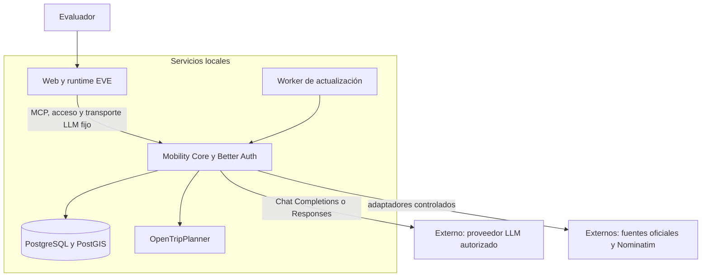

<p align="center">
  <picture>
    <source media="(prefers-color-scheme: dark)" srcset="apps/eve-web/public/brand/logo-dark.svg">
    
  </picture>
</p>

<h1 align="center">mobai</h1>

<p align="center">
  <a href="https://m8ven.ai/mcp/alanslzrr-digital-twin-conversational-mobility-xkwic3?s=readme"></a> &nbsp;
  <a href="https://github.com/alanslzrr/digital-twin-conversational-mobility/actions/workflows/ci.yml"></a> &nbsp;
  <a href="LICENSE"></a> &nbsp;
  <a href="https://www.bestpractices.dev/en/projects/15273/passing"></a>
</p>

<p align="center">
  <strong>La movilidad de Madrid, explicada en una conversación.</strong>
</p>

<p align="center">
  Planifica desplazamientos, consulta llegadas y avisos, y añade el contexto que importa para viajar: meteorología, accesibilidad declarada, bicicletas y aparcamiento. El sistema reúne fuentes oficiales y explica de dónde sale cada resultado y a qué momento corresponde.
</p>

<p align="center">
  El chat de <strong>EVE</strong> coordina la conversación. <strong>Mobility Core</strong> reúne y consulta los datos de los operadores. <strong>OpenTripPlanner</strong> calcula las rutas. Esta separación permite actualizar las fuentes y las reglas de movilidad sin modificar la interfaz de conversación.
</p>

<p align="center">
  <a href="docs/README.md"><strong>Documentación</strong></a> &nbsp;·&nbsp;
  <a href="docs/user-guide.md"><strong>Guía de uso</strong></a> &nbsp;·&nbsp;
  <a href="docs/installation.md"><strong>Instalación</strong></a> &nbsp;·&nbsp;
  <a href="docs/architecture.md"><strong>Arquitectura</strong></a>
</p>

https://github.com/user-attachments/assets/0e122168-1229-4229-b2bd-24607de5f756

---

## Contenido

- [Qué resuelve](#qué-resuelve)
- [Qué puedes hacer](#qué-puedes-hacer)
- [Pantallas del producto](#pantallas-del-producto)
- [Stack tecnológico](#stack-tecnológico)
- [Cómo funciona](#cómo-funciona)
- [Empezar en local](#empezar-en-local)
- [Datos, privacidad y alcance](#datos-privacidad-y-alcance)
- [Estructura del repositorio](#estructura-del-repositorio)
- [Desarrollo y comprobaciones](#desarrollo-y-comprobaciones)
- [Documentación y evolución](#documentación-y-evolución)
- [Licencia](#licencia)

## Qué resuelve

Preparar un viaje suele exigir consultar varias aplicaciones: una para la ruta, otra para saber cuándo llega el autobús, otra para incidencias y otra para el tiempo. mobai conecta esas consultas en el mismo diálogo.

Puedes empezar con un desplazamiento y continuar preguntando por sus alternativas o su contexto. El modelo interpreta la petición y explica los resultados. Para responder, utiliza **herramientas del servidor que consultan datos y calculan rutas**.

El término *gemelo digital* se refiere aquí a una representación de la movilidad que conserva lugares, servicios, publicaciones y sus cambios a lo largo del tiempo.

## Qué puedes hacer

| Capacidad | Qué ofrece |
| --- | --- |
| **Planificar viajes** | Rutas con Renfe, EMT, Metro Ligero, interurbanos y caminatas; límites de caminar y transbordos, con evidencia por tramo |
| **Consultar transporte** | Salidas Renfe, próximas llegadas EMT por parada y horarios estáticos CRTM con calendarios, excepciones y frecuencias |
| **Encontrar lugares** | Estaciones y paradas por nombre o número; búsqueda externa de lugares públicos cuando hace falta y con consentimiento |
| **Revisar avisos** | Incidencias Renfe/EMT, publicaciones DGT y resúmenes almacenados de línea, red y movilidad |
| **Añadir meteorología al viaje** | Predicción horaria/diaria y avisos pertinentes; observaciones por ubicación o estación, con un catálogo inicial de 25 estaciones |
| **Consultar accesibilidad** | Declaraciones estáticas separadas de parada y vehículo, con su fuente y lo que se desconoce |
| **Consultar bicicletas y entorno** | Bicicletas y anclajes BiciMAD, mediciones de aire y sensores de tráfico municipal |
| **Consultar aparcamiento** | Ocupación publicada y tarifas contrastadas de 15 aparcamientos EMT; coste orientativo, máximos y condiciones |
| **Recuperar información** | Chats propios mediante **Mis conversaciones** e histórico de publicaciones de movilidad; son funciones distintas |

### Ejemplos de conversación

> Quiero ir ahora de Atocha Cercanías a Chamartín en tren. Como máximo, 15 minutos a pie y dos transbordos.
>
> Próximas llegadas EMT de la parada 72, con destino y antigüedad de la estimación.
>
> ¿Cuánto costarían 120 minutos en el aparcamiento de Plaza Mayor? Muéstrame también la ocupación disponible.
>
> ¿Qué sabía el sistema de BiciMAD hace diez minutos?

Si un lugar es ambiguo, el chat pide aclaración antes de planificar. La [guía de uso](docs/user-guide.md) explica cómo interpretar horarios, estimaciones, observaciones y precios.

## Pantallas del producto

### Del viaje a la respuesta

El chat muestra las herramientas que resuelven las estaciones y calculan la ruta. Puedes elegir una alternativa y continuar preguntando por la llegada y el margen de tiempo sin empezar de nuevo.

[](docs/demo.md#planificar-y-continuar-la-conversación)

### Bicicletas y anclajes, estación por estación

Explora BiciMAD en el mapa y compara las bicicletas y los anclajes de cada estación en la lista. Los filtros y las horas de observación permiten interpretar los datos que estás viendo.

[](docs/demo.md#explorar-las-estaciones-bicimad)

**[Ver la galería completa](docs/demo.md)**: herramientas desplegadas, resumen del panel y capturas a tamaño completo del 7 de octubre de 2026.

## Stack tecnológico

<p align="center">
  <a href="https://github.com/vercel/eve"></a> &nbsp;
  <a href="https://modelcontextprotocol.io/"></a> &nbsp;
  <a href="https://nextjs.org/"></a> &nbsp;
  <a href="https://www.postgresql.org/"></a> &nbsp;
  <a href="https://www.typescriptlang.org/"></a>
</p>

EVE coordina el chat; MCP conecta sus herramientas con Mobility Core; Next.js sirve la interfaz web; PostgreSQL almacena los datos del núcleo y TypeScript define los contratos compartidos.

## Cómo funciona

El proyecto separa la conversación de las reglas y los datos de movilidad:

| Componente | Responsabilidad |
| --- | --- |
| **EVE + Next.js** | Interfaz oficial, coordinación del agente, ejecución de herramientas y recuperación de conversaciones |
| **Modelo de lenguaje** | Interpreta peticiones, solicita herramientas y redacta respuestas a través de la API de OpenAI |
| **Better Auth** | Valida credenciales y mantiene sesiones en Core. El canal EVE comprueba quién puede abrir o continuar cada conversación |
| **Mobility Core** | Servidor que gestiona proveedores, adquisición de datos, almacenamiento, consultas y planificación |
| **MCP** | Model Context Protocol: conecta EVE con las **16 herramientas de Mobility Core** mediante contratos de entrada y salida |
| **OpenTripPlanner (OTP)** | Calcula itinerarios a partir de horarios GTFS y calles OpenStreetMap |
| **PostgreSQL + PostGIS** | Guarda entidades, geometrías, estado, cachés, histórico y permisos |



1. El evaluador inicia sesión y describe su consulta.
2. EVE coordina el modelo y las herramientas autorizadas de Core.
3. Core resuelve lugares, consulta los datos y utiliza OTP cuando necesita una ruta.
4. Core añade estimaciones, avisos y meteorología cuando hay evidencia aplicable; el modelo explica el resultado.

Core gestiona las conexiones y credenciales de los proveedores. EVE accede a la movilidad a través de las herramientas MCP habilitadas para el agente.

La adquisición periódica usa una **ventana de actividad de 30 minutos**. Las consultas normales la renuevan; el worker no la mantiene abierta por sí mismo. Las cachés compartidas en PostgreSQL permiten reutilizar una adquisición entre usuarios y alternativas de viaje.

Consulta los [flujos detallados](docs/architecture.md), las [herramientas MCP](docs/reference/mcp.md) y el [registro de fuentes](docs/sources/README.md).

## Empezar en local

### Primera instalación

Requisitos: **Node 24.21.0**, **pnpm 10.30.3**, **Python 3.11 o posterior** y **Docker con Compose**. Se necesita Internet para el proveedor LLM seleccionado y para adquirir datos de las fuentes.

La **[guía de instalación](docs/installation.md)** prepara el entorno, la base de datos, los catálogos y el grafo multioperador antes de arrancar las aplicaciones.

Las [instrucciones de cuentas y claves](docs/resources/accounts.md) explican cómo configurar:

- Credenciales LLM de solo escritura en **Mi cuenta**, o patrocinio explícito, custodiados por Core.
- `EMT_CLIENT_ID` y `EMT_PASSKEY` para Core, con una aplicación EMT habilitada.
- `AEMET_API_KEY` para Core, incluida su renovación.
- Nominatim público como respaldo, con sus restricciones y consentimiento.

Las cuentas se crean mediante invitación, con dos roles y TOTP administrativo: [cuentas y consumo multiproveedor](docs/accounts-and-llm.md). Cada persona inicia sesión con sus credenciales y accede a sus propias conversaciones.

### Instalación ya preparada

Con Docker activo y los datos/builds existentes, ejecuta desde la raíz:

```sh
pnpm infra:up
pnpm otp:up
pnpm start:local
```

Abre **[el chat local](http://127.0.0.1:3000/evaluation)** e inicia sesión con tu cuenta. Usa el origen `127.0.0.1` de forma consistente. [Health de Core](http://127.0.0.1:3001/api/health).

Si los servicios ya están arrancados, reutilízalos: no inicies un segundo supervisor. Para detener las aplicaciones, pulsa **Ctrl-C en su terminal**. El procedimiento de parada de infraestructura, actualización y recuperación está en [operación local](docs/local-runtime.md).

Los mensajes al modelo se facturan en la cuenta de OpenAI configurada.

## Datos, privacidad y alcance

**Cada dato conserva su procedencia y sus tiempos.** Las respuestas distinguen horarios previstos, estimaciones y observaciones, e indican la fecha y antigüedad de la información utilizada.

Las credenciales se guardan en archivos privados ignorados por Git. El acceso a la base de datos y a los proveedores de movilidad se concentra en Core. Better Auth y los controles del canal protegen las sesiones; cada evaluador ve sus propias conversaciones. [Seguridad](SECURITY.md) y [acceso y retención](docs/evaluation.md).

El proyecto es una base de evaluación de movilidad. La cobertura de cada operador depende de los datos disponibles: Metro de Madrid conserva catálogo, pero no horarios ni routing actuales. Las rutas en bicicleta/coche y el estado operativo de ascensores están fuera del alcance acordado; se mantienen las consultas BiciMAD, parking y accesibilidad estática.

El [roadmap](docs/roadmap.md) recoge el alcance y las decisiones de desarrollo. La [preparación Vercel](docs/deployment.md) describe la alternativa de alojamiento.

## Estructura del repositorio

```text
apps/
  eve-web/          Chat oficial, agente, acceso y conexión MCP
  mobility-core/    Herramientas MCP, proveedores, datos y routing
packages/
  contracts/        Schemas y tipos compartidos
  domain/           Reglas de movilidad e interpretación de datos
  provenance/       Frescura y calidad temporal
infra/
  local/            Servicios Docker locales
  postgres/         Migraciones de base de datos
  otp/              Configuración del motor de rutas
scripts/            Instalación, importación, operación y comprobaciones
docs/               Wiki, recursos, decisiones y evidencia
```

Los datos descargados, grafos, respaldos y credenciales locales viven fuera del código versionado. [Componentes, variables y persistencia](docs/reference/system.md).

## Desarrollo y comprobaciones

```sh
pnpm check          # lint, fronteras, tipos, pruebas offline y builds Web/Core
pnpm build:agent    # compila EVE con Docker local; no hace inferencias
```

Con los servicios arrancados, `pnpm smoke --production` comprueba HTTP, salud y autenticación. Consulta los [comandos de diagnóstico](docs/local-runtime.md#comprobaciones-disponibles) para elegir la comprobación adecuada.

Usa ramas `alanslzrr/<tema>`, commits Conventional Commits y `pnpm check` antes del push. Conserva la interfaz oficial EVE y la separación Web/Core. [Convenciones del repositorio](AGENTS.md) · [Procedencia de la UI](apps/eve-web/vendor/eve/README.md).

## Documentación y evolución

[Índice completo de documentación](docs/index.md).

| Si quieres… | Empieza aquí |
| --- | --- |
| Comprender el proyecto sin conocer el código | [Visión general](docs/overview.md) y [glosario](docs/glossary.md) |
| Utilizar sus capacidades | [Guía de uso](docs/user-guide.md) |
| Instalarlo o mantenerlo | [Instalación](docs/installation.md), [operación](docs/local-runtime.md) y [problemas frecuentes](docs/troubleshooting.md) |
| Entender una herramienta o un dato | [MCP](docs/reference/mcp.md), [configuración](docs/reference/system.md) y [fuentes](docs/sources/README.md) |
| Consultar investigación y documentación oficial | [Recursos](docs/resources/index.md) y [cuentas/claves](docs/resources/accounts.md) |
| Saber cómo avanzó y qué se comprobó | [Evolución por etapas](docs/evolution.md), [actas](docs/acceptance/index.md) y [alcance](docs/roadmap.md) |
| Mantener la documentación | [Reglas de la wiki](docs/AGENTS.md) y [registro de revisiones](docs/log.md) |

## Licencia

El código propio de mobai se distribuye bajo [licencia MIT](LICENSE). Los componentes de terceros conservan sus licencias y avisos: [EVE (Apache-2.0)](apps/eve-web/vendor/eve/LICENSE), [NOTICE de EVE](apps/eve-web/vendor/eve/NOTICE), [Community Agent (MIT)](apps/eve-web/vendor/community-agent/LICENSE) y [shadcn (MIT)](apps/eve-web/vendor/shadcn/LICENSE).

Los datos de los operadores y la cartografía tienen sus propias condiciones de uso y atribución; consulta el [registro de fuentes](docs/sources/README.md). La licencia del código no sustituye esas condiciones.
