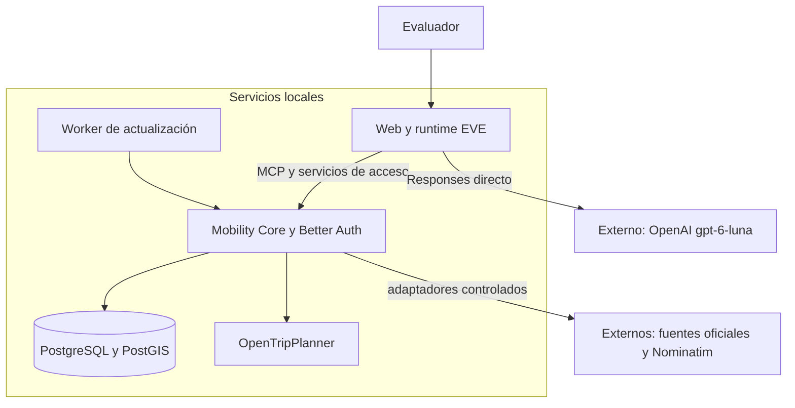

# Madrid Mobility Twin

**La movilidad de Madrid, explicada en una conversación.**

Planifica desplazamientos, consulta llegadas y avisos, y añade el contexto que importa para viajar: meteorología, accesibilidad declarada, bicicletas y aparcamiento. El sistema reúne fuentes oficiales y explica de dónde sale cada resultado y a qué momento corresponde.

Es un proyecto universitario funcional que se ejecuta localmente, con acceso privado para hasta cinco evaluadores. Utiliza el **chat oficial de EVE**, **OpenAI directo con `gpt-6-luna`** y un servidor propio de movilidad. No necesita AI Gateway ni un despliegue en Vercel para funcionar.

[**Documentación completa**](docs/index.md) · [**Guía de uso**](docs/user-guide.md) · [**Instalación**](docs/installation.md) · [**Arquitectura**](docs/architecture.md)

## Contenido

- [Qué resuelve](#qué-resuelve)
- [Qué puedes hacer](#qué-puedes-hacer)
- [Cómo funciona](#cómo-funciona)
- [Empezar en local](#empezar-en-local)
- [Datos, privacidad y alcance](#datos-privacidad-y-alcance)
- [Estructura del repositorio](#estructura-del-repositorio)
- [Desarrollo y comprobaciones](#desarrollo-y-comprobaciones)
- [Documentación y evolución](#documentación-y-evolución)

## Qué resuelve

Preparar un viaje suele exigir consultar varias aplicaciones: una para la ruta, otra para saber cuándo llega el autobús, otra para incidencias y otra para el tiempo. Madrid Mobility Twin conecta esas consultas en el mismo diálogo.

Puedes empezar con un desplazamiento y continuar preguntando por sus alternativas o su contexto. El modelo interpreta la petición y explica los resultados; **las rutas y los datos se obtienen mediante herramientas del servidor**, no de la memoria del modelo.

El término *gemelo digital* se refiere aquí a una representación parcial de la movilidad que conserva lugares, servicios, publicaciones y sus cambios. No implica simular toda la ciudad.

## Qué puedes hacer

| Capacidad | Qué ofrece |
| --- | --- |
| **Planificar viajes** | Rutas con Renfe, EMT, Metro Ligero, interurbanos y caminatas; límites de caminar y transbordos, con evidencia por tramo |
| **Consultar transporte** | Salidas Renfe, próximas llegadas EMT por parada y horarios estáticos CRTM con calendarios, excepciones y frecuencias |
| **Encontrar lugares** | Estaciones y paradas por nombre o número; búsqueda externa de lugares públicos cuando hace falta y con consentimiento |
| **Revisar avisos** | Incidencias Renfe/EMT, publicaciones DGT y resúmenes almacenados de línea, red y movilidad |
| **Añadir meteorología al viaje** | Predicción horaria/diaria y avisos pertinentes; observaciones por ubicación o estación, con un catálogo inicial de 25 estaciones |
| **Consultar accesibilidad** | Declaraciones estáticas separadas de parada y vehículo, con su fuente y lo que se desconoce |
| **Consultar bicicletas y entorno** | Bicicletas y anclajes BiciMAD, mediciones de aire y sensores de tráfico municipal |
| **Consultar aparcamiento** | Ocupación publicada y tarifas contrastadas de 15 aparcamientos EMT; coste orientativo, máximos y condiciones |
| **Recuperar información** | Chats propios mediante **Mis conversaciones** e histórico de publicaciones de movilidad; son funciones distintas |

### Ejemplos de conversación

> Quiero ir ahora de Atocha Cercanías a Chamartín en tren. Como máximo, 15 minutos a pie y dos transbordos.
>
> Próximas llegadas EMT de la parada 72, con destino y antigüedad de la estimación.
>
> ¿Cuánto costarían 120 minutos en el aparcamiento de Plaza Mayor? Muéstrame también la ocupación disponible.
>
> ¿Qué sabía el sistema de BiciMAD hace diez minutos?

Son ejemplos de preguntas, no respuestas precalculadas. Si un lugar es ambiguo, el chat pide aclaración. La [guía de uso](docs/user-guide.md) explica cómo interpretar horarios, estimaciones, observaciones y precios.

## Cómo funciona

El proyecto separa la conversación de las reglas y los datos de movilidad:

| Componente | Responsabilidad |
| --- | --- |
| **EVE + Next.js** | Interfaz oficial, coordinación del agente, ejecución de herramientas y recuperación de conversaciones |
| **OpenAI directo** | `gpt-6-luna` interpreta peticiones y redacta respuestas mediante Responses; sin Gateway ni modelo alternativo |
| **Better Auth** | Acceso por usuario y contraseña; la integración comprueba propiedad de las conversaciones y cuotas |
| **Mobility Core** | Servidor que gestiona proveedores, adquisición de datos, almacenamiento, consultas y planificación |
| **MCP** | Model Context Protocol: conecta EVE con **un servidor de 16 herramientas**, no con un servidor por proveedor |
| **OpenTripPlanner (OTP)** | Calcula itinerarios a partir de horarios GTFS y calles OpenStreetMap |
| **PostgreSQL + PostGIS** | Guarda entidades, geometrías, estado, cachés, histórico y permisos |



1. El evaluador inicia sesión y describe su consulta.
2. EVE coordina el modelo y las herramientas autorizadas de Core.
3. Core resuelve lugares, consulta los datos y utiliza OTP cuando necesita una ruta.
4. Core añade estimaciones, avisos y meteorología cuando hay evidencia aplicable; el modelo explica el resultado.

El modelo no recibe claves EMT/AEMET ni accede directamente a sus APIs. Las herramientas generales de EVE —como shell o búsqueda web libre— están desactivadas.

La adquisición periódica usa una **ventana de actividad de 30 minutos**. Las consultas normales la renuevan; el worker no la mantiene abierta por sí mismo. Las cachés compartidas evitan repetir adquisiciones innecesarias por usuario o alternativa. Redis está disponible en el entorno, pero esta vertical no depende de él.

Consulta los [flujos detallados](docs/architecture.md), las [herramientas MCP](docs/reference/mcp.md) y el [registro de fuentes](docs/sources/README.md).

## Empezar en local

### Primera instalación

Requisitos: **Node 24.21.0**, **pnpm 10.30.3**, **Python 3.11 o posterior** y **Docker con Compose**. Se necesita Internet para OpenAI y para adquirir datos de los proveedores.

Sigue la **[guía de instalación completa](docs/installation.md)**. Distingue la preparación del entorno, las migraciones, los catálogos, el grafo inicial y la activación multioperador. No basta con ejecutar `pnpm dev` sobre un repositorio recién clonado para tener toda la vertical disponible.

Las [instrucciones de cuentas y claves](docs/resources/accounts.md) explican cómo configurar:

- `OPENAI_API_KEY` para el servidor Web, usando la clave y créditos de tu cuenta.
- `EMT_CLIENT_ID` y `EMT_PASSKEY` para Core, con una aplicación EMT habilitada.
- `AEMET_API_KEY` para Core, incluida su renovación.
- Nominatim público como respaldo, con sus restricciones y consentimiento.

Las cuentas de evaluadores se crean por separado con [la administración local](docs/evaluation.md). No hay registro público ni es necesario configurar Google OAuth.

### Instalación ya preparada

Con Docker activo y los datos/builds existentes, ejecuta desde la raíz:

```sh
pnpm infra:up
pnpm otp:up
pnpm start:local
```

Abre **[el chat local](http://127.0.0.1:3000/evaluation)** e inicia sesión con tu cuenta. Usa el origen `127.0.0.1` de forma consistente. [Health de Core](http://127.0.0.1:3001/api/health).

Si los servicios ya están arrancados, reutilízalos: no inicies un segundo supervisor. Para detener las aplicaciones, pulsa **Ctrl-C en su terminal**. El procedimiento de parada de infraestructura, actualización y recuperación está en [operación local](docs/local-runtime.md).

Enviar mensajes al modelo consume créditos de OpenAI. Compilar y ejecutar las pruebas offline no hace inferencias.

## Datos, privacidad y alcance

**Cada dato conserva su procedencia y sus tiempos.** Un horario previsto, una estimación y una observación no significan lo mismo. Volver a descargar una lectura antigua no la convierte en actual; las respuestas distinguen cobertura, ausencia de datos y frescura.

Las credenciales se guardan en archivos privados ignorados por Git. Web no importa clientes de base de datos ni adaptadores de movilidad. Better Auth y los controles del canal protegen las sesiones; cada evaluador ve sus propias conversaciones. [Seguridad](SECURITY.md) y [acceso y retención](docs/evaluation.md).

El alcance actual es una **evaluación local funcional**, no un servicio público con cobertura exhaustiva. Metro de Madrid conserva catálogo, pero no horarios ni routing actuales. Las rutas en bicicleta/coche y el estado operativo de ascensores están fuera del alcance acordado; se mantienen las consultas BiciMAD, parking y accesibilidad estática.

R0 y R1 están cerrados; el historial R2.1 está entregado. Las obligaciones adicionales de cierre R2 fueron retiradas, no declaradas como pruebas ejecutadas. El [roadmap vigente](docs/roadmap.md) recoge las decisiones completas sin convertir estos límites en nuevas tareas.

Los recursos cloud preparados **no están desplegados**. Vercel permanece como [alternativa documentada](docs/deployment.md), con despliegues automáticos desactivados y sin ser requisito para usar el proyecto.

## Estructura del repositorio

```text
apps/
  eve-web/          Chat oficial, agente, acceso y conexión MCP
  mobility-core/    Herramientas MCP, proveedores, datos y routing
packages/
  contracts/        Schemas y tipos compartidos
  domain/           Reglas de movilidad e interpretación de datos
  provenance/       Frescura y calidad temporal
infra/
  local/            Servicios Docker locales
  postgres/         Migraciones de base de datos
  otp/              Configuración del motor de rutas
scripts/            Instalación, importación, operación y comprobaciones
docs/               Wiki, recursos, decisiones y evidencia
```

Los datos descargados, grafos, respaldos y credenciales locales viven fuera del código versionado. [Componentes, variables y persistencia](docs/reference/system.md).

## Desarrollo y comprobaciones

```sh
pnpm check          # lint, fronteras, tipos, pruebas offline y builds Web/Core
pnpm build:agent    # compila EVE con Docker local; no hace inferencias
```

Con los servicios preparados y arrancados, `pnpm smoke --production` comprueba el arranque y el acceso sin llamar al modelo. Las comprobaciones que consultan proveedores, los modos conversacionales live y los benchmarks son operaciones distintas: consulta [qué ejecuta cada comando](docs/local-runtime.md#comprobaciones-disponibles).

Usa ramas `alanslzrr/<tema>`, commits Conventional Commits y `pnpm check` antes del push. Conserva la interfaz oficial EVE y la separación Web/Core. [Convenciones del repositorio](AGENTS.md) · [Procedencia de la UI](apps/eve-web/vendor/eve/README.md).

## Documentación y evolución

La documentación está organizada como una wiki: explicación → fuentes → implementación → evidencia. El README presenta el proyecto; **[el índice de `docs/`](docs/index.md)** permite profundizar sin depender del historial del chat.

| Si quieres… | Empieza aquí |
| --- | --- |
| Comprender el proyecto sin conocer el código | [Visión general](docs/overview.md) y [glosario](docs/glossary.md) |
| Utilizar sus capacidades | [Guía de uso](docs/user-guide.md) |
| Instalarlo o mantenerlo | [Instalación](docs/installation.md), [operación](docs/local-runtime.md) y [problemas frecuentes](docs/troubleshooting.md) |
| Entender una herramienta o un dato | [MCP](docs/reference/mcp.md), [configuración](docs/reference/system.md) y [fuentes](docs/sources/README.md) |
| Consultar investigación y documentación oficial | [Recursos](docs/resources/index.md) y [cuentas/claves](docs/resources/accounts.md) |
| Saber cómo avanzó y qué se comprobó | [Evolución por etapas](docs/evolution.md), [actas](docs/acceptance/index.md) y [alcance](docs/roadmap.md) |
| Mantener la documentación | [Reglas de la wiki](docs/AGENTS.md) y [registro de revisiones](docs/log.md) |
