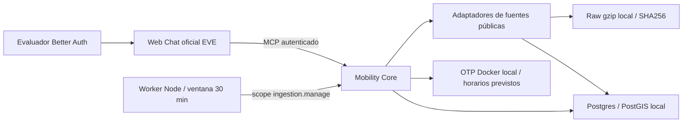

# Arquitectura de evaluación

## Decisiones

1. Dos aplicaciones separadas; Next.js alberga frontend/EVE y otro proyecto Next.js sirve el MCP. Usar Next en Core es una decisión de empaquetado de Route Handlers, no una dependencia del dominio respecto al frontend.
2. Identidad, timestamps y calidad pertenecen al dominio. El modelo explica resultados estructurados, no calcula coordenadas o itinerarios.
3. EVE tiene `defaultTools: false`. Quitar secretos no impide consultar una API pública; también deben retirarse web/shell y evitar nuevas herramientas de acceso directo.
4. Construcciones y CI sin secretos cloud ni llamadas de pago. El modelo es `gpt-6-luna`, vía SDK nativo Responses con clave explícita del servidor Web. EVE lo resuelve en `step.started`, con ventana de contexto explícita para evitar consultar metadatos de Gateway. No hay fallback ni selector de modelo.
5. **Local primero**: PostGIS y OTP Docker, raw en disco local y worker Node. Los recursos cloud previos están separados; no hay deployments. Redis no es necesario para la primera vertical.

Implementado: Renfe trip updates/alertas, BiciMAD oficial, aire, tráfico, parking municipal y observaciones AEMET Madrid-Retiro; contratos/normalización, IDs canónicos, snapshots y herramienta por capacidad real. El modelo nunca conoce URLs de fuentes o sus claves. Consultar [runtime local](local-runtime.md) para cadencias, acceso, retención y límites concretos.

## Ingestión adaptativa implementada

La ventana se renueva con `GREATEST(active_until, now()+30 min)` tras autorización. Los jobs se adquieren atómicamente solo dentro de ventana, si están vencidos y la fuente está habilitada. Leases de propietario expiran a 90 s; publicación verifica propiedad/expiración y no permite retroceder el timestamp de fuente. Un fallo conserva la observación anterior con su edad, aumenta backoff y no se convierte en dato live.

El worker ejecuta dos carriles concurrentes, HTTP acotado y ticks repetibles. Read-through comparte esas mismas garantías. No mantiene una cadena Queues ni bucle Workflow. En previews/producción Vercel está desactivado incondicionalmente: su futura adaptación necesita outbox/reconciliación durables y almacenamiento no efímero, no simplemente mover este proceso a una Function.

## Persistencia y raw

PostGIS: lugares y namespaces externos, catálogo estático importado, versiones/calendarios, salud, actividad, leases, snapshots e histórico. El raw gzip es local/durable en esta máquina, deduplicado por SHA256, con retención objetivo de 24 h purgada durante ticks activos. No se sustituye observación por hora de descarga. Una observación fresca puede seguir siendo provisional.

OTP consume el mismo GTFS normalizado que el importador. Se comprueba la versión del manifiesto de grafo contra la base. En esta fase el itinerario usa horarios previstos; RT Renfe se consulta aparte para estimaciones y alertas. No se añade un segundo polling dentro de OTP que ignore la ventana de actividad.

## Acceso y huecos

- El MCP implementa JWT de servicio con scopes de lectura, gestión de evaluación y worker separados. OAuth/rotación/asimetría son trabajo posterior.
- El canal EVE está envuelto por un guard de identidad, origen, propiedad y cuotas. No se depende del middleware Next: las rutas EVE pueden resolverse antes. Better Auth vive en Core; Web reenvía cookies por un proxy autenticado de mismo origen. PostgreSQL impone hasta cinco evaluadores y ACL por sesión.
- Datos estáticos CRTM no equivalen a tiempo real Metro/interurbanos. Accesibilidad estática no garantiza ascensores operativos.
- El estado `not_initialized` no es un error del proveedor y el catálogo no prueba acceso, licencia o disponibilidad.

## Referencias verificadas al preparar el entorno

- [EVE: despliegue Vercel](https://github.com/vercel/eve/blob/main/docs/guides/deployment/vercel.mdx)
- [EVE: integración Next.js](https://github.com/vercel/eve/blob/main/docs/guides/frontend/nextjs.mdx)
- [EVE: herramientas predeterminadas](https://github.com/vercel/eve/blob/main/docs/concepts/built-in-tools.md)
- [EVE: autenticación y propiedad de sesiones](https://github.com/vercel/eve/blob/main/docs/guides/auth-and-route-protection.md)
- [Queues: entrega, reintentos y demoras](https://vercel.com/docs/queues)
- [Queues: SDK y claves de idempotencia](https://vercel.com/docs/queues/sdk)
- [MCP handler v2 y compatibilidad de protocolos](https://github.com/vercel-labs/mcp-handler)

Consulta realizada el 23 de septiembre de 2026. No se incorporan las cifras de cuota del brief como garantías; deben revisarse en la cuenta antes de ejecutar la evaluación.
