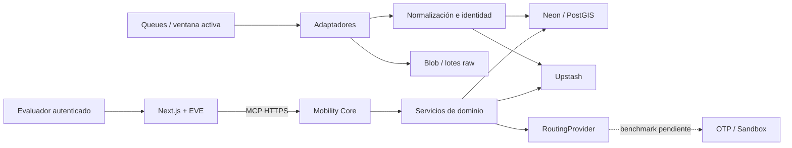

# Arquitectura de evaluación

## Decisiones

1. Dos aplicaciones separadas; Next.js alberga frontend/EVE y otro proyecto Next.js sirve el MCP. Usar Next en Core es una decisión de empaquetado de Route Handlers, no una dependencia del dominio respecto al frontend.
2. Identidad, timestamps y calidad pertenecen al dominio. El modelo explica resultados estructurados, no calcula coordenadas o itinerarios.
3. EVE tiene `defaultTools: false`. Quitar secretos no impide consultar una API pública; también deben retirarse web/shell y evitar nuevas herramientas de acceso directo.
4. Construcciones y CI sin secretos cloud ni llamadas de pago. El modelo se elige al iniciar una sesión mediante `EVE_MODEL`; no hay un fallback silencioso a otro proveedor.
5. Neon/PostGIS, Upstash, Blob, Queues y OTP bajo demanda son el objetivo de despliegue, no recursos ya provisionados.

El diagrama representa el destino. En esta base solo están implementados el runtime/configuración EVE, el MCP de diagnóstico, contratos, frescura y esquema inicial local.

## Ingesta adaptativa: contrato de implementación

No basta con que un consumidor publique otro mensaje cada veinte segundos:

- Queues entrega **al menos una vez**. Un mismo tick puede ejecutarse más de una vez. Requiere idempotencia por ventana/generación, tick y fuente.
- Renovar `active_until` debe ser atómico y monótono (`max(actual, now + 30 min)`). Dos evaluadores no deben iniciar dos cadenas.
- El arranque necesita lease/bloqueo con token de propietario y liberación compare-and-delete. El estado durable/outbox debe cubrir fallos entre persistir el tick y publicarlo.
- Una generación expirada no puede reiniciar ingestión. Comprobar ventana al consumir y antes de publicar el siguiente tick.
- Entrega retrasada significa "no antes de", no una cadencia exacta. Medir lag y frescura, no prometer tiempo real de 20 s.
- Cada fuente mantiene su `next_due_at`, timeout, backoff y aislamiento de errores. Ejecutar tareas acotadas; un proveedor lento no debe bloquear a los demás.
- El read-through comparte locks, cuotas e idempotencia con la ingesta y responde con última observación + marca stale si falla la actualización.
- Recuperar una cadena perdida mediante reconciliación en interacciones y, si procede, un mantenimiento diario. No un Workflow infinito.
- Preview usa recursos y prefijos separados; ingestión desactivada por defecto. Un feature flag debe poder apagarla inmediatamente.

## Persistencia y raw

PostGIS almacena entidades, índices espaciales, IDs externos y salud. El SQL actual es el esquema inicial, no un GTFS completo. El histórico normalizado y las políticas de retención se añaden al implementar la primera ingesta.

Batch raw no implica concatenar ficheros en el disco efímero de una Function. Persistir primero en staging durable y sellar lotes inmutables identificados por hash; validar formatos y conservar timestamps. Sin raw durable no se debe prometer replay. Elegir explícitamente retención limitada si el presupuesto no permite guardar todas las muestras.

Redis es caché/lease, no única fuente de verdad. Los IDs externos incluyen namespace para evitar colisiones entre distintos feeds/versiones. Una observación fresca no convierte un dato provisional en validado.

## Acceso y huecos

- El MCP implementa JWT de servicio scoped para bootstrap. OAuth/rotación/asimetría son trabajo posterior.
- EVE local no equivale a autorización multiusuario: la auth del canal no impone propiedad de sesiones. No habilitar usuarios reales sin esa comprobación.
- Datos estáticos CRTM no equivalen a tiempo real Metro/interurbanos. Accesibilidad estática no garantiza ascensores operativos.
- El estado `not_initialized` no es un error del proveedor y el catálogo no prueba acceso, licencia o disponibilidad.

## Referencias verificadas al preparar el entorno

- [EVE: despliegue Vercel](https://github.com/vercel/eve/blob/main/docs/guides/deployment/vercel.mdx)
- [EVE: integración Next.js](https://github.com/vercel/eve/blob/main/docs/guides/frontend/nextjs.mdx)
- [EVE: herramientas predeterminadas](https://github.com/vercel/eve/blob/main/docs/concepts/built-in-tools.md)
- [EVE: autenticación y propiedad de sesiones](https://github.com/vercel/eve/blob/main/docs/guides/auth-and-route-protection.md)
- [Queues: entrega, reintentos y demoras](https://vercel.com/docs/queues)
- [Queues: SDK y claves de idempotencia](https://vercel.com/docs/queues/sdk)
- [MCP handler v2 y compatibilidad de protocolos](https://github.com/vercel-labs/mcp-handler)

Consulta realizada el 23 de septiembre de 2026. No se incorporan las cifras de cuota del brief como garantías; deben revisarse en la cuenta antes de ejecutar la evaluación.
