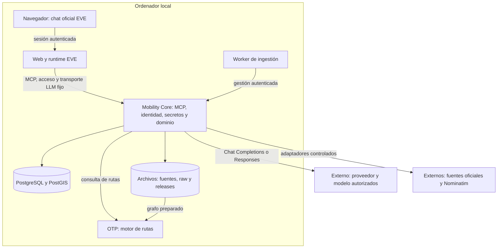
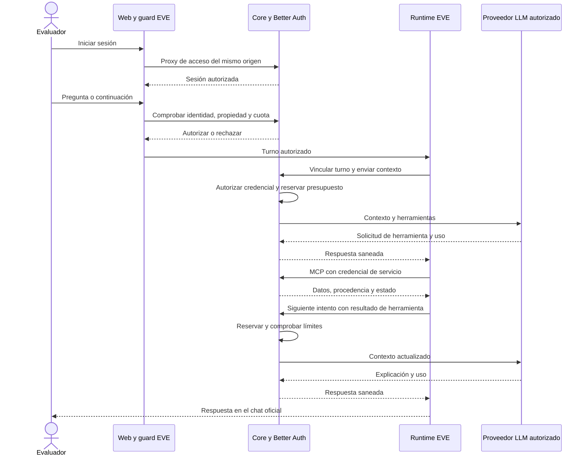
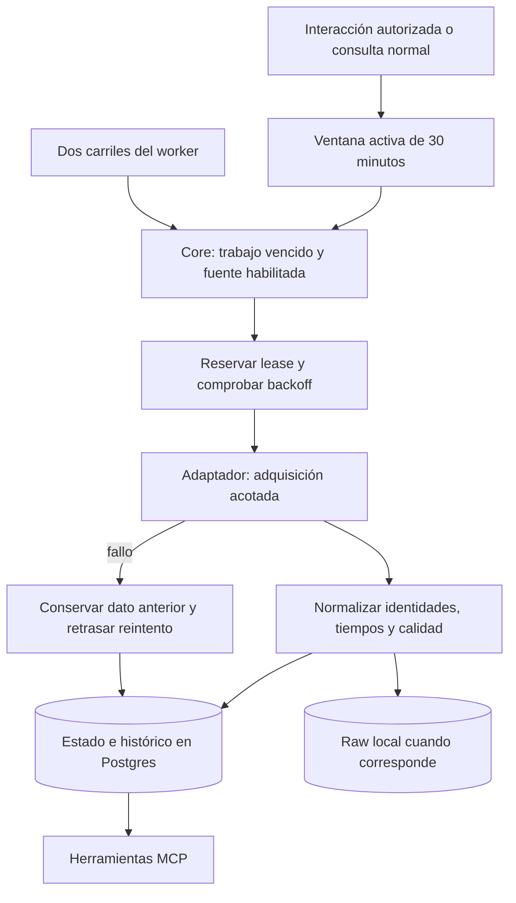
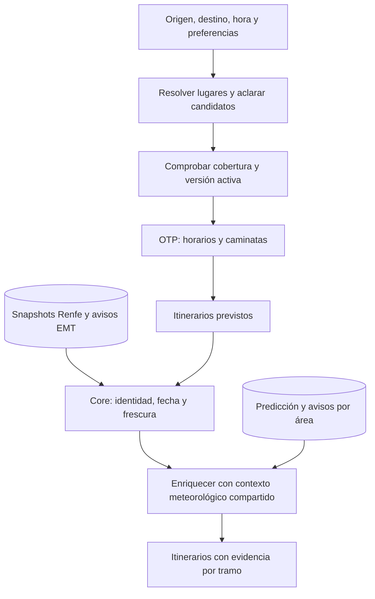
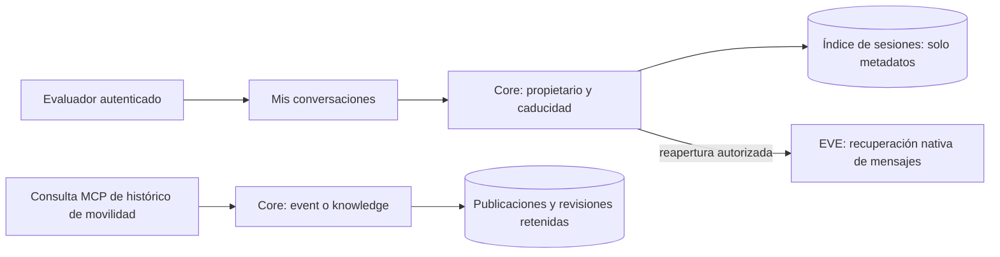
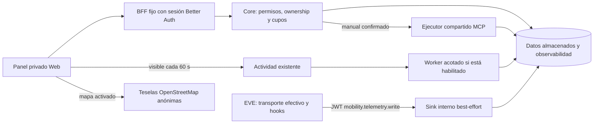

# Cómo funciona

[Índice](index.md) · [Visión general](overview.md) · [Referencia del sistema](reference/system.md) · [Recursos técnicos](resources/index.md#tecnología)

## En esta página

- [Arquitectura general](#arquitectura-general)
- [Recorrido de una pregunta](#recorrido-de-una-pregunta)
- [Adquisición de datos](#adquisición-de-datos)
- [Planificación de un viaje](#planificación-de-un-viaje)
- [Dos históricos distintos](#dos-históricos-distintos)
- [Decisiones y fronteras](#decisiones-y-fronteras)

## Arquitectura general

La separación permite mejorar datos o rutas sin rehacer el chat. **EVE** es el marco que proporciona la interfaz y coordina el agente. **Mobility Core** es nuestro servidor de dominio: conoce operadores, lugares, datos y reglas. **MCP** (Model Context Protocol) es el protocolo que conecta las herramientas del agente con ese servidor. **OTP** (OpenTripPlanner) calcula itinerarios sobre horarios y calles.

1. El [navegador](../apps/eve-web/app) muestra el chat y envía las peticiones a la Web con la cookie de sesión.
2. La [Web/EVE](../apps/eve-web/agent/agent.ts) conecta el modelo y el [MCP de Core](../apps/mobility-core/app/mcp/route.ts). Existe un servidor con 16 herramientas.
3. [Core](../apps/mobility-core/src) aplica reglas y guarda datos. [PostGIS](../infra/postgres/migrations) añade consultas geográficas a PostgreSQL.
4. [OTP local](../infra/local/compose.yaml) carga el grafo de horarios y calles que utiliza para calcular rutas.
5. EVE accede al modelo únicamente a través de Core; Core adquiere publicaciones de las fuentes. Las consultas de movilidad reutilizan los datos y cachés de PostgreSQL. Al activar el mapa del panel, el navegador también carga teselas anónimas de OpenStreetMap; ese tráfico está separado de las consultas a Core.

## Recorrido de una pregunta

Una herramienta es una operación definida, como resolver una parada o planificar un viaje. El modelo propone su uso; el runtime ejecuta la operación y devuelve el resultado para redactar una respuesta.

1. [Better Auth](../apps/mobility-core/src/better-auth.ts), en Core, valida las credenciales y guarda usuarios y sesiones de acceso en PostgreSQL. El [proxy de autenticación](../apps/eve-web/app/api/auth/[...all]/route.ts) permite que el navegador use `/api/auth/*` desde el mismo origen de la Web. La cookie de sesión es `HttpOnly` y `SameSite=Strict`; usa `Secure` cuando el origen es HTTPS.
2. El [guard del canal EVE](../apps/eve-web/src/evaluation-guard.ts) consulta la identidad y pide a Core autorización para cada operación. Core comprueba cuenta activa, propietario de la conversación y cuota. Al crear una conversación, el guard registra su identificador y propietario en Core. Así, conocer la URL de otra conversación no da acceso a sus mensajes.
3. EVE fija el [modelo seleccionado](../apps/eve-web/src/model.ts) al iniciar el turno. Core valida identidad, credencial, financiación y presupuesto antes de cada petición a Chat Completions o Responses. El modelo solicita herramientas y EVE ejecuta el ciclo; no se introduce otro agente. [Selección, secretos y ledger](accounts-and-llm.md).
4. Las llamadas servidor a servidor usan un JWT con permisos: `mobility.read` para [MCP](reference/mcp.md) y `mobility.evaluation.manage` para gestionar acceso. Esta credencial identifica al servicio Web; la sesión de Better Auth identifica a la persona. Todas las claves externas, tanto de movilidad como LLM, permanecen en Core.
5. EVE puede realizar varios pasos para responder una pregunta. Al alcanzar el límite de continuidad, muestra una pausa: **Aprobar / Approve** permite continuar y **Detener / Stop** detiene el turno, según el idioma de la interfaz. [Comportamiento y pruebas](acceptance/2026-09-25-e2-closure.md), [localización de controles](ui-i18n.md).

EVE tiene habilitadas las herramientas MCP de movilidad. `defaultTools: false` desactiva las herramientas generales de shell y búsqueda web. La [interfaz de EVE](../apps/eve-web/vendor/eve/README.md) incorpora el acceso autenticado y el listado de conversaciones.

## Adquisición de datos

**Ingestión** significa adquirir una publicación y guardarla. Un **adaptador** entiende el formato de un proveedor; la **normalización** lo convierte en entidades compartidas. Una **lease** reserva temporalmente un trabajo para evitar que dos procesos lo publiquen a la vez.

1. El [worker](../scripts/ingestion-worker.mjs) pide actualizaciones durante la ventana de actividad. Al vencer, espera a que una interacción la renueve.
2. [Core y sus leases](../apps/mobility-core/src/ingestion.ts) seleccionan trabajos vencidos. Tras una interrupción, retoman la actualización desde el estado guardado y omiten los ciclos ya pasados.
3. Los [adaptadores](../apps/mobility-core/src/adapters) conservan la hora de la publicación y registran por separado cuándo se adquirió.
4. [Las políticas de dominio](../packages/domain/src/ingestion.ts) separan frecuencia de adquisición, frescura y reintentos. [Provenance](../packages/provenance/src/index.ts) calcula calidad temporal.
5. Algunas consultas hacen **read-through**: intentan refrescar solo su fuente si vence, compartiendo locks/backoff. Llegadas EMT, geocodificación y meteorología tienen cachés específicas. Los tres agregados leen almacenamiento, sin refrescar ni renovar la ventana.

El almacenamiento depende del producto: algunos conservan la publicación original; llegadas EMT guarda el resultado normalizado y su checksum. Las respuestas de autenticación quedan excluidas de estos archivos. [Persistencia y cadencias](reference/system.md).

## Planificación de un viaje

**GTFS** describe paradas, recorridos, horarios y calendarios de transporte. **OSM** aporta la red de calles. El **grafo** combina esos datos para que OTP calcule conexiones. Un **overlay** añade información dinámica a una ruta prevista, sin reconstruir el grafo.

1. [Resolución](../apps/mobility-core/src/mobility.ts) entrega identificadores estables. [Nominatim](sources/geocoding.md) es un respaldo para lugares públicos, con consentimiento.
2. [Routing](../apps/mobility-core/src/routing.ts) verifica versión de catálogos/grafo, hora, modos y preferencias. `TRANSIT` exige al menos un tramo de transporte público y permite accesos a pie.
3. OTP usa Renfe, EMT, Metro Ligero e interurbanos admitidos por la release. Calendarios, excepciones y frecuencias determinan cada servicio. Metro actual está fuera del alcance.
4. [Evidencia dinámica](../apps/mobility-core/src/routing-evidence.ts) añade estimaciones Renfe cuando identifica el viaje correspondiente y adjunta avisos EMT a sus líneas. Core utiliza las publicaciones adquiridas por el worker; OTP calcula el itinerario base.
5. [Meteorología del viaje](../apps/mobility-core/src/journey-weather.ts) consulta la caché por lugares y periodos del itinerario. Añade predicción y avisos disponibles; si faltan, devuelve la ruta con el contexto meteorológico marcado como no disponible.

La accesibilidad describe por separado paradas y vehículos mediante sus atributos estáticos. Las correspondencias entre redes conservan los IDs originales y la evidencia que los relaciona. [Detalle y activación del grafo](routing-releases.md).

## Dos históricos distintos

EVE guarda los mensajes del chat; Core guarda el índice de propietarios y las publicaciones de movilidad. Cada consulta utiliza el almacenamiento y los permisos correspondientes.

1. [Core](../apps/mobility-core/src/conversations.ts) devuelve el índice de conversaciones del propietario, veinte entradas por página. Los mensajes se recuperan desde EVE.
2. [La Web](../apps/eve-web/app/evaluation/conversations.tsx) abre la sesión original; el guard vuelve a comprobar permisos. Una recuperación vacía muestra «no disponible».
3. [El histórico de movilidad](../apps/mobility-core/src/history.ts) tiene dos lecturas: `event` puede incluir correcciones aprendidas después; `knowledge` solo incluye lo conocido entonces.
4. El histórico devuelve muestras de publicaciones retenidas. La retención objetivo de movilidad es 24 horas, con purga durante actividad.
5. La caducidad del chat bloquea el acceso y conserva los mensajes almacenados en EVE. [Retención y cuentas](evaluation.md).

## Decisiones y fronteras

| Decisión implementada | Función | Dónde se comprueba |
| --- | --- | --- |
| Web separada de Core | Concentrar fuentes y base de datos en Core | [Check de fronteras](../scripts/check-boundaries.mjs) |
| Contratos compartidos estrictos | Validar entradas y definir resultados entre componentes | [Contracts](../packages/contracts/src/index.ts) |
| Reloj del servidor para «hace diez minutos» | Resolver fechas relativas desde la hora de consulta | [Histórico](../apps/mobility-core/src/history.ts) |
| Una representación del resultado MCP | Entregar una única copia de cada resultado al agente | [Serialización](../apps/mobility-core/src/mcp-result.ts) |
| Releases coordinadas | Mantener catálogos y grafo en la misma versión | [Activador](../scripts/activate-routing-release.mjs) |
| Pruebas offline sin claves | Ejecutar comprobaciones con fixtures reproducibles | [CI](../.github/workflows/ci.yml) |

**Fuentes y evidencia:** [recursos técnicos](resources/index.md#tecnología), [registro de fuentes](sources/README.md), [actas por entrega](acceptance/index.md), [historia del proyecto](evolution.md).

## Panel y captura de observabilidad

El panel conserva la identidad y el canal Web existentes. Sus lecturas usan DTO saneados de Core, no SQL desde Web. El mapa externo es independiente de los datos de movilidad. El registro único de herramientas alimenta tanto MCP como el catálogo y la ejecución manual.

La lectura almacenada, la renovación de actividad y la ejecución manual son caminos separados. El sink escribe mediante un pool dedicado con deadlines SQL; no comparte locks con presupuesto y falla abierto. El terminal de intento puede conservar entrada, resultado y uso aunque la preparación se haya perdido. Los resúmenes priorizan el terminal y deduplican intentos; tokens cached son subconjunto de input, no un sumando adicional.

[Referencia técnica](reference/system.md#panel-y-telemetría) · [Uso](user-guide.md#panel-privado) · [Validación](acceptance/2026-10-02-core-dashboard.md).
