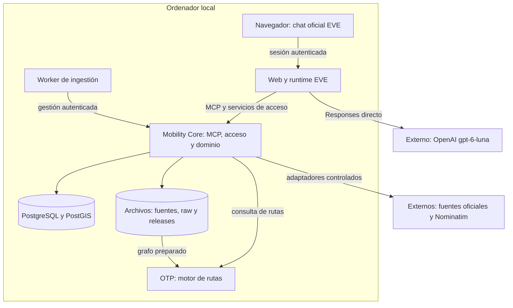
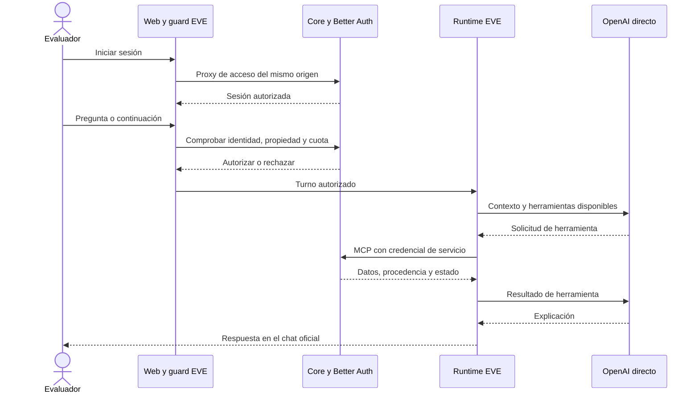
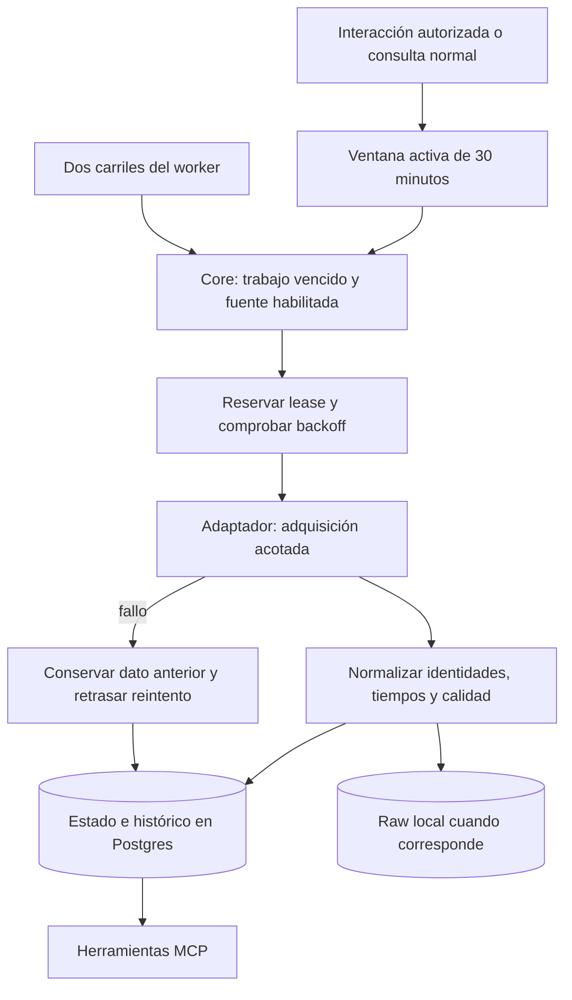
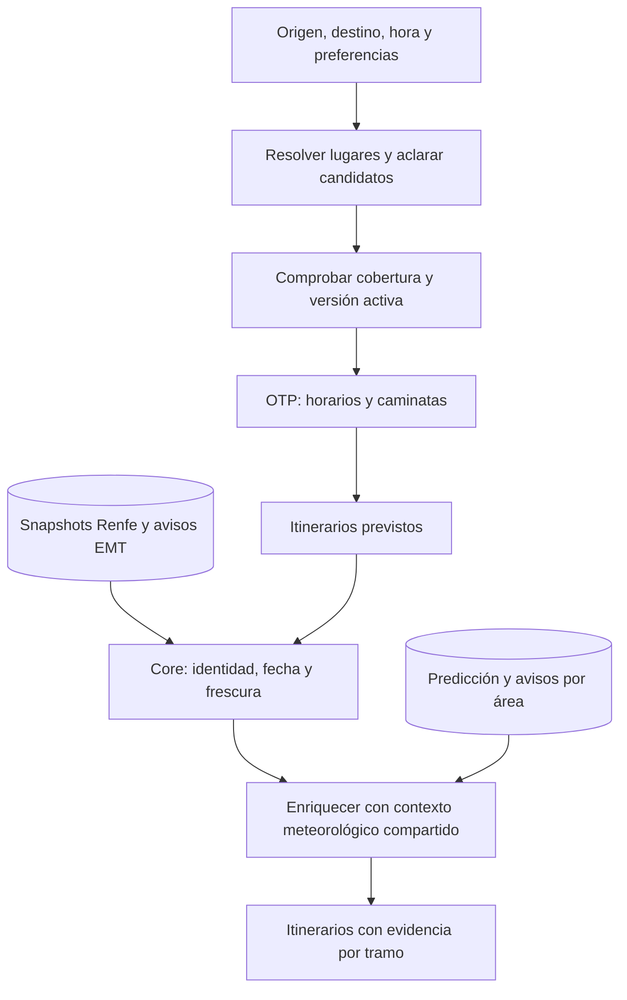
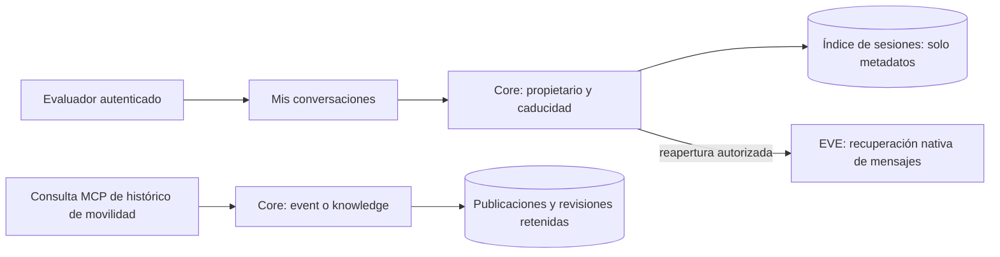

# Cómo funciona

[Índice](index.md) · [Visión general](overview.md) · [Referencia del sistema](reference/system.md) · [Recursos técnicos](resources/index.md#tecnología)

## En esta página

- [Arquitectura general](#arquitectura-general)
- [Recorrido de una pregunta](#recorrido-de-una-pregunta)
- [Adquisición de datos](#adquisición-de-datos)
- [Planificación de un viaje](#planificación-de-un-viaje)
- [Dos históricos distintos](#dos-históricos-distintos)
- [Decisiones y fronteras](#decisiones-y-fronteras)

## Arquitectura general

La separación permite mejorar datos o rutas sin rehacer el chat. **EVE** es el marco que proporciona la interfaz y coordina el agente. **Mobility Core** es nuestro servidor de dominio: conoce operadores, lugares, datos y reglas. **MCP** (Model Context Protocol) es el protocolo que conecta las herramientas del agente con ese servidor. **OTP** (OpenTripPlanner) calcula itinerarios sobre horarios y calles.

1. El [navegador](../apps/eve-web/app) no tiene claves de proveedores ni acceso a la base.
2. La [Web/EVE](../apps/eve-web/agent/agent.ts) conecta el modelo y el [MCP de Core](../apps/mobility-core/app/mcp/route.ts). Existe un servidor con 16 herramientas.
3. [Core](../apps/mobility-core/src) aplica reglas y guarda datos. [PostGIS](../infra/postgres/migrations) añade consultas geográficas a PostgreSQL.
4. [OTP local](../infra/local/compose.yaml) carga un grafo ya construido. No llama al modelo.
5. Internet sigue siendo necesario para OpenAI y las nuevas adquisiciones. Neon, Upstash, Blob, Queues y Sandbox cloud no forman parte de este flujo local. Redis está disponible en Compose, pero la vertical no depende de él.

## Recorrido de una pregunta

Una herramienta es una operación definida, como resolver una parada o planificar un viaje. El modelo propone su uso; el runtime ejecuta la operación y devuelve el resultado para redactar una respuesta.

1. [Better Auth](../apps/mobility-core/src/better-auth.ts) valida el login. El proxy mantiene un único origen para el navegador.
2. El [guard del canal](../apps/eve-web/src/evaluation-guard.ts) comprueba propietario y cuota antes de ejecutar EVE. No basta con ocultar una página o proteger solo middleware.
3. El [modelo configurado](../apps/eve-web/src/model.ts) usa OpenAI Responses directamente: `gpt-6-luna`, sin Gateway ni fallback.
4. [MCP](reference/mcp.md) exige JWT de servicio y scope `mobility.read`. Las claves EMT/AEMET no salen de Core.
5. EVE puede realizar varios pasos y llamadas al modelo para una pregunta. La [continuidad E2](acceptance/2026-09-25-e2-closure.md) usa Approve/Stop; no hace falta crear una campaña.

Las herramientas generales de EVE están desactivadas (`defaultTools: false`): no hay shell ni búsqueda web genérica para que el agente eluda Core. La [interfaz oficial](../apps/eve-web/vendor/eve/README.md) se mantiene, con adaptaciones mínimas de acceso e historial.

## Adquisición de datos

**Ingestión** significa adquirir una publicación y guardarla. Un **adaptador** entiende el formato de un proveedor; la **normalización** lo convierte en entidades compartidas. Una **lease** reserva temporalmente un trabajo para evitar que dos procesos lo publiquen a la vez.

1. El [worker](../scripts/ingestion-worker.mjs) no mantiene activa la ventana por sí mismo. Sin uso, deja de pedir datos periódicos.
2. [Core y sus leases](../apps/mobility-core/src/ingestion.ts) deciden qué trabajo procede. No repiten todos los ciclos perdidos tras una interrupción.
3. Los [adaptadores](../apps/mobility-core/src/adapters) preservan la hora publicada. Descargar hoy una lectura de ayer no la convierte en actual.
4. [Las políticas de dominio](../packages/domain/src/ingestion.ts) separan frecuencia de adquisición, frescura y reintentos. [Provenance](../packages/provenance/src/index.ts) calcula calidad temporal.
5. Algunas consultas hacen **read-through**: intentan refrescar solo su fuente si vence, compartiendo locks/backoff. Llegadas EMT, geocodificación y meteorología tienen cachés específicas. Los tres agregados leen almacenamiento, sin refrescar ni renovar la ventana.

No se archivan tokens de login ni respuestas privadas de autenticación. No todos los productos guardan un archivo raw: por ejemplo, llegadas EMT conserva un checksum de resultado. [Persistencia y cadencias](reference/system.md).

## Planificación de un viaje

**GTFS** describe paradas, recorridos, horarios y calendarios de transporte. **OSM** aporta la red de calles. El **grafo** combina esos datos para que OTP calcule conexiones. Un **overlay** añade información dinámica a una ruta prevista, sin reconstruir el grafo.

1. [Resolución](../apps/mobility-core/src/mobility.ts) entrega identificadores estables. [Nominatim](sources/geocoding.md) es un respaldo para lugares públicos, con consentimiento.
2. [Routing](../apps/mobility-core/src/routing.ts) verifica versión de catálogos/grafo, hora, modos y preferencias. `TRANSIT` exige transporte y permite accesos a pie; no equivale a una ruta íntegramente peatonal.
3. OTP usa Renfe, EMT, Metro Ligero e interurbanos admitidos por la release. Calendarios, excepciones y frecuencias determinan cada servicio. Metro actual está fuera del alcance.
4. [Evidencia dinámica](../apps/mobility-core/src/routing-evidence.ts) aplica Renfe cuando hay correspondencia demostrada; avisos EMT contextualizan líneas, sin fabricar desvíos. No hay otro polling RT dentro de OTP.
5. [Meteorología del viaje](../apps/mobility-core/src/journey-weather.ts) usa lugares y periodos del itinerario, comparte caché y no invalida una ruta por falta de predicción. No sigue al usuario ni cambia automáticamente su viaje.

La accesibilidad separa declaraciones de parada y vehículo; no acredita ascensores operativos. Los IDs de distintas redes se relacionan mediante evidencia, no se fusionan por compartir nombre. [Detalle y activación del grafo](routing-releases.md).

## Dos históricos distintos

El listado de conversaciones y las publicaciones antiguas resuelven necesidades diferentes. No comparten permisos ni almacenamiento de contenido.

1. [Core](../apps/mobility-core/src/conversations.ts) devuelve el índice propio, veinte entradas por página. No copia los mensajes de EVE.
2. [La Web](../apps/eve-web/app/evaluation/conversations.tsx) abre la sesión original; el guard vuelve a comprobar permisos. Una recuperación vacía muestra «no disponible».
3. [El histórico de movilidad](../apps/mobility-core/src/history.ts) tiene dos lecturas: `event` puede incluir correcciones aprendidas después; `knowledge` solo incluye lo conocido entonces.
4. El histórico devuelve muestras acotadas de publicaciones retenidas, no toda la ciudad en un instante. La retención objetivo de movilidad es 24 horas, con purga durante actividad.
5. Expirar permisos del chat no borra físicamente mensajes EVE. [Retención y cuentas](evaluation.md).

## Decisiones y fronteras

| Decisión implementada | Qué evita | Dónde se comprueba |
| --- | --- | --- |
| Web separada de Core | Importar fuentes/DB en el chat | [Check de fronteras](../scripts/check-boundaries.mjs) |
| Contratos compartidos estrictos | Peticiones ambiguas o herramientas ficticias | [Contracts](../packages/contracts/src/index.ts) |
| Reloj del servidor para «hace diez minutos» | Calcular fechas desde datos antiguos | [Histórico](../apps/mobility-core/src/history.ts) |
| Una representación del resultado MCP | Duplicar evidencia en el contexto | [Serialización](../apps/mobility-core/src/mcp-result.ts) |
| Releases coordinadas | Usar un catálogo y un grafo de versiones incompatibles | [Activador](../scripts/activate-routing-release.mjs) |
| Pruebas offline sin claves | Necesitar cuentas de proveedor para compilar o revisar | [CI](../.github/workflows/ci.yml) |

**Fuentes y evidencia:** [recursos técnicos](resources/index.md#tecnología), [registro de fuentes](sources/README.md), [actas por entrega](acceptance/index.md), [historia del proyecto](evolution.md). La arquitectura cloud inicial fue una alternativa de despliegue; no describe procesos locales como si fueran Functions o Queues.
