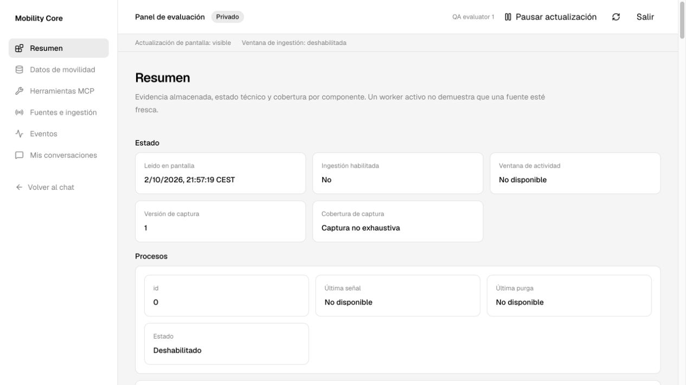

# Spec-audit de PR #45: datos, telemetría y dashboard

**Implementación posterior:** [acta de refinamiento del 03/10/2026](../acceptance/2026-10-03-core-dashboard-refinement.md), con HEAD, pruebas, capturas y verificaciones pendientes.
**Segunda verificación:** [auditoría con agent-browser del 03/10/2026](../acceptance/2026-10-03-core-dashboard-second-audit.md), nueve hallazgos adicionales corregidos y límites de revisión explícitos.
[Índice](../index.md) · [Auditorías](index.md) · [Spec acordado](../plans/2026-10-02-core-dashboard.md) · [Acta original](../acceptance/2026-10-02-core-dashboard.md) · [Alcance](../roadmap.md)

**Contraste independiente posterior:** [cinco hallazgos reproducidos o contrastados el 03/10/2026](#contraste-independiente-del-03102026). CI verde no equivale a aceptación funcional completa.

## Dictamen

**Requiere cambios antes de integrar o instalar.** La base arquitectónica es aprovechable y la CI está verde, pero se han reproducido fallos de captura y de interpretación de datos. La UI conserva los tokens de EVE, no la jerarquía de información de la referencia. No conviene añadir gráficos encima de esas discrepancias.

Revisión del commit **`56b1f25576bf50c62cead67513cc644e3e5f6859`**, cabeza de [PR #45](https://github.com/alanslzrr/digital-twin-conversational-mobility/pull/45) el 02/10/2026. Comparado con `a3825de003da4de20a955995133bd6b40c08b5c5`, el spec, los contratos, la implementación, las pruebas y las capturas archivadas. El [workflow de esa cabeza](https://github.com/alanslzrr/digital-twin-conversational-mobility/actions/runs/37053763324) terminó correctamente.

Esta auditoría añade documentación y evidencia, no corrige la implementación. No modifica la instalación habitual, auth, proveedores, datos de usuarios, el chat ni la PR remota. No requiere OpenTelemetry Collector ni otra infraestructura: la imagen aportada coincide con la composición de [Community Agent](https://community-agent.labs.vercel.dev/), no obliga a adoptar una plataforma de observabilidad.

**Ampliación acordada el 02/10/2026:** el [spec de refinamiento](#spec-de-refinamiento-para-el-agente) es el encargo vigente para completar esta misma PR. Sustituye la propuesta visual inicial por requisitos implementables de las seis vistas, métricas, contratos y aceptación. Los hallazgos y las pruebas de `56b1f25` se conservan como evidencia histórica, no como validación del futuro rediseño. El [spec original](../plans/2026-10-02-core-dashboard.md) sigue rigiendo arquitectura, seguridad, efectos, límites y retención; este documento concreta su presentación y corrige las desviaciones encontradas.

## Contenido

- [Hallazgos funcionales](#hallazgos-funcionales)
- [Auditoría visual](#auditoría-visual)
- [Spec de refinamiento para el agente](#spec-de-refinamiento-para-el-agente)
  - [Mandato y límites](#mandato-y-límites)
  - [Referencias y skills](#referencias-y-skills)
  - [Navegación y separación de datos](#navegación-y-separación-de-datos)
  - [Semántica y lenguaje](#semántica-y-lenguaje)
  - [Las seis vistas](#las-seis-vistas)
  - [Métricas y gráficos obligatorios](#métricas-y-gráficos-obligatorios)
  - [Contratos y datos pendientes](#contratos-y-datos-pendientes)
  - [Sistema visual e interacción](#sistema-visual-e-interacción)
  - [Actualización sin efectos ocultos](#actualización-sin-efectos-ocultos)
  - [Implementación y aceptación](#implementación-y-aceptación)
  - [Encargo breve para el agente](#encargo-breve-para-el-agente)
- [Pruebas y límites](#pruebas-y-límites)
- [Orden de corrección](#orden-de-corrección)
- [Contraste independiente del 03/10/2026](#contraste-independiente-del-03102026)

## Hallazgos funcionales

Prioridades: **P1** bloquea una capacidad central o la interpretación fiable del dato; **P2** debe corregirse en este bloque. Las líneas se refieren al commit auditado, no a futuras revisiones.

### F1 · P1 · Se descartan las herramientas con el nombre real de EVE

**Ubicación:** [telemetry.ts](../../apps/eve-web/src/telemetry.ts), líneas 189 y 234–242; [telemetry-projection.ts](../../apps/eve-web/src/telemetry-projection.ts), líneas 50–65 y 129–137.

La conexión se llama `mobility`. EVE 0.65 genera nombres cualificados `mobility__get_network_status`, etc. Se verificó en el paquete instalado, `dist/src/execution/tools/connection-search.js`: `qualifiedConnectionToolName(connection, tool)` concatena `connection + "__" + tool`. Tanto los hooks como el transporte reciben esos nombres, pero `dashboardToolName` solo admite los 16 nombres MCP sin prefijo. `captureTool` falla al parsear y su `catch` lo silencia. La proyección descarta igualmente las definiciones y llamadas efectivas. `connection_search` tampoco está representada como herramienta de descubrimiento.

**Reproducción offline:** invocar `captureTool` con `mobility__get_network_status` produce **cero envíos al sink**; proyectar una entrada con ese nombre produce **cero definiciones y cero mensajes de llamada**. Los tests existentes utilizan nombres sin prefijo y no detectan el fallo. No se necesitó inferencia pagada.

**Corrección:** distinguir nombre efectivo del runtime y nombre canónico MCP; resolver exclusivamente el prefijo fijo de la conexión autorizada, sin aceptar herramientas arbitrarias. Conservar ambos y el `callId`. Representar el descubrimiento con su esquema saneado y diferenciarlo del catálogo MCP; no registrar una herramienta MCP adicional. Probar requested/result/error/rejected y las definiciones/llamadas del transporte con los nombres reales de EVE.

### F2 · P1 · El explorador calcula una frescura meteorológica distinta de Core

**Ubicación:** [entities.ts](../../apps/mobility-core/src/dashboard/entities.ts), líneas 49–75, 135–146 y 239.

El proyector usa `getFreshness(checkedAt)` y el filtro SQL repite esa simplificación. No aplican [weatherFreshness](../../packages/provenance/src/weather.ts): ignoran antigüedad de emisión, errores del recurso y el límite de 24 horas. Así, una comprobación reciente de un forecast emitido hace dos días devuelve `recently_checked`, aunque el dominio devuelve `unavailable`; con comprobación reciente y error, devuelve `recently_checked` en vez de `stale`.

**Reproducción PostgreSQL:** ambos casos fallan con fixtures en un esquema desechable. Se preserva el horizonte futuro para aislar la diferencia de emisión/error. Una 304 o lectura de pantalla no debe rejuvenecer la emisión.

**Corrección:** reutilizar la política de provenance por producto y hacer que proyección y filtro compartan exactamente la misma semántica. Probar emisión, errores, 304, tiempos futuros y horizonte; no copiar umbrales en SQL y TypeScript sin pruebas de equivalencia.

### F3 · P2 · La proyección genérica elimina información necesaria para interpretar entidades

**Ubicación:** [entities.ts](../../apps/mobility-core/src/dashboard/entities.ts), líneas 76–111, 122–134 y 228–231.

Un periodo meteorológico se transforma en `value: 18 °C`, sin conservar `kind: temperature`, `basis` ni su periodo: `validFrom/validTo` se toman del documento completo. Dos periodos del mismo municipio pueden resultar indistinguibles. La proyección acepta casi únicamente números/booleanos; los campos textuales y anidados de otros productos tampoco se convierten en una ficha de dominio. El detalle de entidad muestra el mismo DTO reducido y su JSON, por lo que expandirlo no recupera esos datos.

**Reproducción PostgreSQL:** un periodo que empieza dentro de una hora recibe como inicio el del documento, una hora anterior. El nombre de su medida se construye como `value`, no como la variable meteorológica.

**Corrección:** presenters explícitos por producto/categoría. Conservar intervalos y magnitudes, distinción instantáneo/acumulado, identidades y correspondencias, descripciones/vigencia de incidencias y líneas/tiempos de salidas. Usar coordenadas publicadas aunque estén en identidades anidadas; no inventarlas. Auditar las siete categorías con fixtures de sus adaptadores reales, no solo BiciMAD. El DTO técnico también debe conservar la semántica permitida.

### F4 · P2 · Uso desconocido se convierte en cero para caché y reasoning

**Ubicación:** [readers.ts](../../apps/mobility-core/src/dashboard/readers.ts), líneas 345–359.

Cuando ningún intento tiene uso reportado, `reported=[]`. `some(...)` es falso y `reduce(..., 0)` devuelve cero para `cachedInputTokens` y `reasoningTokens`, mientras entrada/salida quedan en `null`. El cero significa una medición que no existe.

**Reproducción PostgreSQL:** un terminal con `usage:null` devuelve caché `0` y reasoning `0`. **Corrección:** mantener ambos nulos sin muestras; distinguir sumas parciales y denominadores cuando solo algunos intentos reportan uso. Probar cero explícito, ausencia total y mezcla de intentos conocidos/desconocidos.

### F5 · P2 · El inspector oculta el truncamiento de su resultado

**Ubicación:** [ruta interna](../../apps/mobility-core/app/internal/dashboard/[...path]/route.ts), líneas 130–132 y 183–189; [safe-data.ts](../../packages/contracts/src/safe-data.ts), líneas 101–115.

La ruta conserva `projection.data`, descarta `projection.truncated` y construye el envelope con `truncated:false`. Ante un resultado voluminoso, el saneador elimina claves completas; puede desaparecer `result` mientras permanece `availability:"available"`. El límite es correcto, su presentación no.

**Reproducción offline:** 100 incidencias sintéticas con descripciones de 8.000 caracteres hacen que `safeProjection(...,240000)` marque truncamiento y elimine `result`. La ruta no transmite esa señal.

**Corrección:** propagar truncamiento/omisión y cobertura de forma tipada; mantener un resumen interpretable y orientar a reducir filtros. No presentar un resultado eliminado como completo. Añadir un test de la ruta/BFF y de su estado visual con respuesta realmente sobredimensionada.

### F6 · P2 · El refresco del feed cambia de clave y pierde el dato anterior

**Ubicación:** [views.tsx](../../apps/eve-web/app/%28dashboard%29/dashboard/_components/views.tsx), líneas 631–662; [dashboard-client.tsx](../../apps/eve-web/src/dashboard-client.tsx), líneas 193–199.

Cada 15 s se incorporan nuevas fechas ISO a la clave SWR de Eventos. `keepPreviousData:false` trata cada tick como una selección nueva: durante la petición desaparece el feed anterior. Además, deduplicación/elegibilidad se calculan sobre la clave nueva, no sobre la misma ventana viva. Es una divergencia estática comprobada en el código; no se midió la duración del parpadeo bajo red lenta en navegador.

**Corrección:** clave estable para el modo vivo y resolución del rango en el fetcher/servidor, o conservación limitada al mismo usuario y selección semántica. Al paginar, congelar la ventana y respetar el cursor; nunca conservar contenido entre identidades. Prueba de componente con respuesta diferida, foco, pausa y cambio de usuario.

## Auditoría visual

### Alcance y cobertura

Next.js App Router, React, Tailwind, Radix/shadcn, Geist/Geist Mono y tokens EVE. Revisados shell, helpers, las seis vistas, mapa y estados; navegador aislado en claro para login, Resumen y telemetría. Oscuro y móvil se contrastaron con la evidencia archivada, no con una nueva sesión de dispositivos. El chat oficial y sus primitivas no son objeto de rediseño.

| Área | Cobertura | Resultado |
| --- | --- | --- |
| Tipografía | Código, claro en navegador y capturas oscuras | Misma fuente correcta; falta escala de métricas, unidades legibles y terminología de usuario. |
| Superficies | Código y evidencia visual | Un contenedor por propiedad y anidamiento repetitivo; la información importante no destaca. |
| Animación/estados | Código y navegación normal | F6; no se revisaron transiciones a velocidad 10 % ni reduced-motion en navegador. Evitar animaciones de cifras periódicas. |
| Iconos/interacción | Código y teclado en telemetría | Lucide coherente; faltan estados con icono/texto y comportamiento completo de pestañas. |
| Rendimiento | Código, límites y tamaño del DOM | Leaflet diferido y límites correctos; árbol recursivo innecesario y repintado completo de marcadores. No se hizo profiling de FPS/bundle. |

**Evidencia medida:** el Resumen del arnés generó **80 tarjetas escalares**, altura **6.847 px**, en viewport de **720 px de alto**. La primera pantalla prioriza fecha de lectura, habilitación, versión de captura y metadatos de workers; no responde «qué datos tengo y qué necesita atención».



Esta captura usa cuentas sintéticas del arnés. No contiene conversaciones de usuarios ni cifras inventadas para simular actividad.

### Hallazgos de interfaz

Severidad visual independiente de la prioridad funcional anterior. El conjunto requiere cambios; U1 es **HIGH** por impedir la lectura de resumen que se solicitó.

| ID / severidad | Ubicación | Antes → después | Principio / motivo |
| --- | --- | --- | --- |
| U1 · HIGH | `views.tsx:101–112`, `shared.tsx:158–205` | `Readable` recorre todo el DTO → composición explícita de 4–6 indicadores, cobertura, tendencia y actividad reciente | Jerarquía. Una versión de esquema no es un KPI; 80 tarjetas no son un resumen. |
| U2 · MEDIUM | `views.tsx:880–920` | IDs, límites y estados tienen el mismo peso que tokens → resumen compacto, tabla por turno y timeline por intento/herramienta | Densidad. Detalles técnicos bajo disclosure; no una tarjeta por atributo. |
| U3 · MEDIUM | `map.tsx:93–105` | Todos los puntos azules y tooltip solo con nombre → leyenda y marcadores con frescura/categoría; ficha con tiempo y valores | Semántica. El mapa no permite distinguir datos antiguos sin abrir cada punto. Usar texto/icono además de color y conservar tabla equivalente. |
| U4 · MEDIUM | `views.tsx:344–354`, `shared.tsx:157,173` | `String(value)`, `missing`, `turns`, `session Bytes` → etiquetas españolas, unidades, `Intl.NumberFormat`, `tabular-nums` en comparaciones | Tipografía. Mantener Geist, no introducir otra identidad visual. |
| U5 · MEDIUM | `views.tsx:881–897` | Botones con `role=tab`, sin roving focus/panel asociado → Tabs existente o patrón completo de teclado/ARIA | Interacción. En navegador ArrowRight no cambia selección; faltan `tabpanel` y relaciones accesibles. |
| U6 · MEDIUM | `views.tsx:845–862,900–903` | Herramientas/Modelo filtran solo la página general, y el vacío usa `rows` → filtrar antes de paginar en Core y estado vacío por selección | Contenido. Una página sin tools puede dejar una pestaña en blanco aunque existan en páginas posteriores. El fixture de una sola entrada deja Herramientas vacía sin explicación. |
| U7 · MEDIUM | `shell.tsx:117–156`, `views.tsx:133–146,180` | Controles pequeños y filtros locales que se pierden al volver del detalle → hit area 44 px en móvil y selección/paginación en URL | Navegación. Reutilizar botones EVE con clases locales; no modificar todas las pantallas del chat. |
| U8 · LOW | `map.tsx:92–110`, `views.tsx:42–99` | Reconstrucción completa de marcadores y tarjetas recursivas → reconciliar por ID y componentes específicos | Rendimiento percibido. No debe desaparecer un tooltip por cada refresh ni crecer el DOM sin aportar información. |

### Candidatos descartados

- **No es un fallo que un cursor se rechace tras cambiar `from/to`.** Se reprodujo y se mantuvo como control negativo: el cursor queda correctamente ligado a la selección. La UI de paginación debe congelarla, no quitar esa protección.
- **No se propone cambiar la fuente/paleta global ni copiar el selector de tema de la demo.** EVE es la autoridad visual; el problema es composición, semántica y densidad.
- **No se propone sustituir auth ni implantar una plataforma de logs externa.** Better Auth, SQL, scopes y ownership existentes resuelven el acceso; las carencias identificadas no necesitan otro servicio.
- **No se considera defectuoso que la tabla funcione sin teselas ni que no se haya llamado al modelo para QA.** Es una separación deseable; lo que falta son fixtures fieles al runtime real y pruebas visuales de los estados acordados.

## Spec de refinamiento para el agente

### Mandato y límites

**Entregar un dashboard completo y comprensible, no un retoque de colores ni un visor de JSON.** Una persona evaluadora sin conocimientos de MCP debe poder descubrir qué información tiene el sistema, distinguir una lectura reciente de una antigua, localizar un problema y examinar sus propias consultas. Cada sección responde una pregunta; cada indicador tiene una definición verificable y una acción de detalle.

- Corregir **F1–F6 y U1–U8** dentro de esta misma entrega. Ningún gráfico compensa datos incorrectos, filtros incompletos o pérdida de telemetría.
- Mantener las seis vistas y sus rutas. Destacar datos dinámicos y separar catálogos en navegación y cómputos. Rediseñar la composición de todas las vistas, no solo Resumen.
- Conservar EVE oficial, login, ownership, componentes, fuentes y paleta. El chat `/s` y sus controles no se rediseñan. No añadir otro selector de tema.
- Reutilizar Core, PostgreSQL, workers, almacenamiento e ingestión existentes. Añadir lectores/agregaciones/contratos donde falten; no otro pipeline, almacén de movilidad, collector, Redis, Cron o servicio de analytics.
- No generar datos para rellenar gráficos. Las fixtures son exclusivamente QA, identificadas como tales y excluidas del runtime de producto.
- Todos los evaluadores activos ven movilidad y operación saneada; contenido, métricas de conversación y ejecuciones manuales siguen siendo propios. El resumen compartido no muestra volumen de conversaciones, usuarios o tokens globales.
- No añadir nuevas fuentes, routing, edición de configuración, reinicios, reintentos de ingestión, exportación masiva, alertas externas ni obligaciones R2 retiradas. No instalar sobre 3000/3001, activar cloud o hacer llamadas de pago para completar este encargo sin autorización aparte.

**Regla de intención:** documentar en tests/contratos, para cada módulo, `pregunta → dato → cálculo → límite → acción`. Si no se puede completar esa cadena, el módulo no debe aparecer como un KPI. No sustituir los módulos requeridos por placeholders: implementar el lector de los datos existentes o mostrar su ausencia real con causa comprobada.

### Referencias y skills

Las cuatro imágenes del usuario se archivan sin modificaciones. Son **inspiración visual con datos de demostración**, no capturas del producto ni código/licencias para copiar. Su interpretación obligatoria:

| Referencia / ubicación | Antes en el panel auditado | Después requerido | Por qué |
| --- | --- | --- | --- |
| [Dashboard de métricas](assets/core-dashboard/reference-metrics.png), Resumen y telemetría | Muchas tarjetas equivalentes, sin lectura principal | Franja de KPI alineados, un gráfico principal por pregunta, selector de periodo, desglose útil debajo | Jerarquía y exploración. No copiar visitantes, conversiones, porcentajes de crecimiento, 30/90 días, exportación o comparación sin datos. |
| [Webhooks](assets/core-dashboard/reference-webhooks.png), Fuentes y Eventos | Metadatos recursivos separados del problema | Lista compacta de fuentes, selección visible, detalle relacionado, barras de actividad y filas de resultado/duración | Conectar estado, causa y evidencia. No copiar endpoints, secretos, avatares ni botones Retry que vuelvan a consultar al proveedor. |
| [Selector de disponibilidad](assets/core-dashboard/reference-selection.png), filtros e inspector | JSON/etiquetas técnicas como entrada principal | Opciones con nombres humanos, selección inequívoca, resumen de parámetros y una acción primaria contextual | La elección debe entenderse antes de actuar. No copiar agenda, personas ficticias o una confirmación que oculte efectos. |
| [Sidebar](assets/core-dashboard/reference-sidebar.png), shell | Seis enlaces sin agrupación conceptual | Grupos Información / Sistema / Personal, selección padre-hijo y retorno al chat estable | Orientación. No copiar Inbox, Projects, Settings editables ni otro sistema de cuentas. |
| Community Agent, referencia ya fijada en el spec original | Tokens compatibles pero sin su composición | Sidebar/header sobrios, resumen reconocible, tendencia y actividad reciente | Continuidad con la referencia aprobada; no importar backend ni cifras demo. |

**Skills requeridas:** leer y aplicar las instalaciones disponibles de `better-ui` y `emil-design-eng`. En este entorno existen en `/Users/alansalazar/.agents/skills/better-ui/SKILL.md` y `/Users/alansalazar/.agents/skills/emil-design-eng/SKILL.md`; ambas se revisaron para este encargo. No se reinstalaron. En otro entorno, si faltan, los comandos solicitados son:

```sh
npx skills add https://github.com/jakubkrehel/skills --skill better-ui
npx skills add https://github.com/emilkowalski/skills --skill emil-design-eng
```

Son herramientas de trabajo, no dependencias de la aplicación. Fuentes primarias: [better-ui](https://github.com/jakubkrehel/skills/tree/main/skills/better-ui) y [emil-design-eng](https://github.com/emilkowalski/skills); repositorios consultados el 02/10/2026. Prioridad: restricciones de seguridad/EVE → requisitos de este spec → criterios de las skills. No adoptar sus ejemplos decorativos como funcionalidades. La autoauditoría final usará una tabla **Severidad / Ubicación / Antes / Después / Motivo**, con evidencia y estados no verificados; no bastará afirmar «premium».

### Navegación y separación de datos

Conservar las rutas; cambiar solo títulos visibles cuando se indica. La sidebar mantiene seis accesos principales:

| Grupo | Etiqueta principal | Ruta | Pregunta |
| --- | --- | --- | --- |
| Información | Resumen | `/dashboard` | ¿Qué puedo consultar ahora y qué limitaciones tiene? |
| Información | Movilidad | `/dashboard/mobility` | ¿Qué dice el dato de este lugar o servicio? |
| Información | Consultas | `/dashboard/tools` | ¿Qué puedo preguntar y qué devuelve la herramienta? |
| Sistema | Fuentes y actualización | `/dashboard/sources` | ¿Cómo llega la información y por qué no se renueva? |
| Sistema | Actividad del sistema | `/dashboard/activity` | ¿Qué ha ocurrido y qué falló? |
| Personal | Mis conversaciones | `/dashboard/conversations` | ¿Qué se registró en mis conversaciones? |

Los subtítulos conservan precisión: «Herramientas MCP disponibles» en Consultas; «Ingestión y procesos de actualización» en Fuentes. No obligar a conocer esas siglas para navegar. Cuenta y «Volver al chat» al pie; identidad solo del usuario conectado. Ruta de detalle mantiene el grupo padre seleccionado y breadcrumb con retorno a sus filtros.

**Dentro de Movilidad, dos pestañas de primer nivel:**

1. **Datos que cambian** — selección inicial. Llegadas/estimaciones, incidencias/avisos, BiciMAD, aire/meteorología, sensores de tráfico y ocupación de aparcamientos. Subselector de producto cuando difieran magnitud, política o periodicidad. Predicciones y avisos se nombran como tales; no se rotulan observaciones.
2. **Catálogos de referencia** — paradas/estaciones/líneas y correspondencias existentes, horarios publicados, accesibilidad declarada, tarifas documentales y geografía instalada. Mostrar versión, fecha de incorporación, vigencia y límites. No son datos «en directo» ni fallos de ingestión por no actualizarse cada minuto.

Las dos pestañas pueden usar el mismo shell/tabla/mapa, pero no una bolsa de filas separada únicamente por un badge `static`. Tarifas no compiten con plazas libres; un horario no compite con una estimación de llegada. Las observaciones y predicciones de meteorología tampoco comparten la misma columna temporal sin etiqueta.

**Inventario cerrado en Core:** derivar familias dinámicas de los nueve `jobPolicies`, llegadas EMT y los tres tipos de producto meteorológico bajo demanda —horario, diario y avisos CAP—. Una familia no equivale a cada municipio, caché o job individual; esos son recursos en su detalle. Mantener la correspondencia tipada entre familia, categoría, fuente, modo periódico/bajo demanda y política existente. No deducirla de qué filas devuelve la primera página. Incluir familias sin datos para explicar su ausencia. Catálogos y recursos auxiliares de resolución no entran en los indicadores de frescura dinámica.

### Semántica y lenguaje

Tres niveles de lectura: **valor y significado → procedencia/limitación → detalle técnico**. La información necesaria para interpretar el dato permanece visible; el JSON, identificadores, versiones de esquema, leases y códigos se consultan bajo «Detalle técnico». No esconder el aviso de antigüedad, cobertura o truncamiento dentro de un tooltip.

| Evidencia real | Texto principal / explicación visible | No escribir |
| --- | --- | --- |
| Observación dentro de su política de frescura | «Lectura reciente · observada hace …»; fuente y hora | «En vivo» por estar conectado el navegador |
| Observación antigua conservada | «Dato antiguo · última observación …»; «No describe necesariamente el estado actual» | Un total actual que incluya ese valor sin avisar |
| No existe lectura almacenada | «Sin lectura guardada»; causa conocida o «No hay más información registrada» | `missing`, cero o «El proveedor está caído» |
| Recurso bajo demanda nunca solicitado | «Sin consulta previa guardada»; enlace al inspector, sin ejecutarlo | Error de fuente o actualización automática de todos los municipios/paradas |
| Predicción válida según provenance | «Predicción para … · publicada …» y «Comprobada …» por separado | «Temperatura actual», ni rejuvenecer emisión con una 304 |
| Predicción sin emisión normalizable | Fecha original/criterio registrado y «Antigüedad de publicación no confirmada», según política | Una hora local/UTC inventada |
| Catálogo disponible | «Datos de referencia · versión …»; «Vigencia …» o «No indicada» | «Reciente» solo por la fecha de importación |
| Horario fuera de vigencia | «Horario fuera de vigencia»; puede seguir disponible su catálogo | Horarios actuales de Metro o disponibilidad operativa de ascensores |
| Consulta correcta con colección vacía | «No hay avisos/llegadas en la lectura guardada para esta selección», con fecha/cobertura | «Sin incidencias en Madrid», ni «Sin datos» si el cero está acreditado |
| Cobertura parcial | «Datos de X de Y …» si Y conocido; de lo contrario «Cobertura total no conocida» | 100 % de cobertura por recibir una página completa |
| Captura no instrumentada/omitida/caducada | «No se registró», «Contenido omitido por …» o «Registro caducado», según evidencia | Cero tokens, tiempo de respuesta o actividad inexistente |
| Fallo de refresco | «No se pudo releer. Mostrando la lectura de …» | Borrar a cero o aparentar una lectura nueva |
| Resultado limitado | «Resultado incompleto por el límite de tamaño. Reduce los filtros» | `available` sin advertir que se omitió el resultado |

**Tres relojes separados:**

- **Observado / publicado / válido para:** describe el dato del proveedor. Siempre junto al valor cuando corresponda.
- **Incorporado / comprobado:** describe lo que Core guardó o verificó. No sustituye al primero.
- **Pantalla leída a las …:** describe esta consulta al almacenamiento. Solo cambia tras una respuesta correcta; no certifica frescura.

«Actualizar pantalla» tendrá texto visible de ayuda: **«Relee los datos guardados. No solicita una lectura nueva a las fuentes.»** En el estado de actividad: **«Mientras este panel está visible, mantiene la ventana de actualización existente. Cada fuente conserva su frecuencia.»** Explicar ambas frases juntas evita prometer que abrir el panel no puede mantener trabajo del worker: lo mantiene mediante el heartbeat separado, no mediante sus GET.

Mostrar horas en `Europe/Madrid`, fecha cuando no sea hoy y zona identificable; conservar ISO/UTC en detalle técnico. Duraciones y números con formato `es-ES`, unidades y cifras tabulares. «Sin dato» no se abrevia a un guion ambiguo. Calidad provisional/desconocida se muestra aparte de antigüedad. Ningún estado depende solo de color.

### Las seis vistas

#### V1. Resumen

**Intención:** entender la información disponible en la primera pantalla, antes de diagnosticar infraestructura.

Composición requerida en escritorio, sin un hero ni una tarjeta por atributo:

1. Cabecera «Resumen de movilidad», frase «Datos guardados que puede consultar el asistente», hora de lectura y controles comunes.
2. Franja compacta: conexión del panel / actualización del sistema / advertencia pertinente. Nunca un único punto verde «Todo funciona». Los problemas de una fuente no ocultan las demás.
3. **Cuatro KPI:** «Bicicletas disponibles», «Plazas libres publicadas», «Avisos vigentes publicados» y «Productos con datos utilizables». Definiciones M1–M4 abajo. Cada uno muestra alcance/cobertura y enlaza a la selección que explica la cifra. Se evalúan al instante de lectura; el selector temporal del gráfico de actividad no cambia ese alcance. No comparación temporal decorativa.
4. Superficie principal 2/3: **«Qué información puedes consultar»**, seis filas de temas dinámicos. En cada fila, nombre humano, productos incluidos, resumen útil, recuentos de recientes/antiguos/sin lectura con su unidad y enlace. No sumar sensores, periodos y estaciones como si fueran la misma entidad. Aire/meteorología se desglosa en observación, predicción y avisos.
5. Columna 1/3: **«Necesita atención»**, máximo tres problemas verificables ordenados por impacto; describir efecto para el usuario y acción «Ver fuente»/«Ver datos antiguos». «No se han detectado problemas en las señales disponibles» no equivale a garantía universal. Ausencia normal de demanda no es alarma. Enlace a Catálogos de referencia con una frase, no otra batería de KPI.
6. Debajo: **«Actualizaciones guardadas»**, barras temporales de publicaciones registradas, con periodo 1 h / 24 h / 7 días (24 h inicial), y **«Actividad reciente»**, cinco eventos saneados con «Ver toda». Subtítulo inequívoco: actividad de captura, no evolución del tráfico ni frescura de toda la ciudad. Indicador M7.

A 1440×900 deben verse cabecera, KPI y comienzo sustancial de datos/atención; a 1280×720, al menos los cuatro KPI y la primera fila útil, sin un bloque previo de metadatos. No fijar alturas que corten traducciones/zoom. Sin mapa externo en Resumen por defecto: el enlace «Ver en el mapa» abre la misma selección en Movilidad; evita descargar teselas solo por visitar el resumen.

#### V2. Movilidad y catálogos

**Intención:** localizar un dato, saber qué significa y comprobar si sirve para esta consulta.

- Pestañas Datos que cambian / Catálogos de referencia, filtros de temática/producto/fuente, búsqueda local y estado explicados. Estado en URL con claves validadas; no argumentos privados ni contenido de conversaciones. Buscar no geocodifica ni llama proveedores.
- Encabezado de resultados con total de la selección y recuento de página claramente separados; mini distribución de antigüedad M5 para el producto seleccionado, no un gráfico circular de cifras heterogéneas.
- Lista por defecto, control Lista / Mapa. En modo mapa a ancho suficiente, mapa y lista compacta coordinados; en móvil, alternancia sin duplicar sus consultas. Mantener filtros/selección/cámara al volver. Filas con estados de hover/foco/selección discretos.
- Presenters por producto, no `Object.entries` para construir toda la pantalla. El detalle incluye medidas, tiempos, fuente, calidad, cobertura, motivo de ausencia, historial soportado y consultas relacionadas; JSON secundario.

| Producto / categoría | Información principal de fila y ficha | Salvaguarda |
| --- | --- | --- |
| BiciMAD | Estación, bicicletas disponibles, bases libres, servicio, observación y fuente | Una estación deshabilitada no aporta disponibilidad utilizable a M1; cero explícito se conserva. |
| Ocupación | Aparcamiento, plazas publicadas por categoría, observación y procedencia | Separar tipos de plaza y tarifas. No deducir plazas libres de una capacidad estática ni duplicar categorías solapadas. |
| Llegadas/estimaciones | Parada, línea, destino, hora prevista/estimada, referencia de cálculo, fuente | Un countdown no renueva el dato. Sin tracking de vehículos, ni recalcular una estimación antigua como llegada actual. Horarios programados van en Catálogos. |
| Incidencias y avisos | Título, organismo, transporte/zona, vigencia, estado publicado, última lectura | Retirada no significa cancelación; conservar historial/estado publicado. Deduplicar revisiones por identidad dentro de cada producto, no suponer equivalencia entre proveedores. |
| Aire | Estación, contaminante/magnitud, valor, unidad, hora, calidad | No promediar contaminantes ni inventar índice sanitario/«aire bueno». |
| Meteorología | Observaciones por estación; predicción por municipio/variable/periodo; avisos por zona | Preservar acumulación, instantáneo, emisión, comprobación y horizonte por registro. No usar el periodo del documento para todos sus valores. |
| Tráfico | Sensor, magnitud publicada, unidad, hora, calidad | No traducir intensidad a velocidad, congestión o ETA sin un producto que lo sustente. |
| Catálogos | Identidad, nombre, fuente, versión/importación/vigencia; líneas, correspondencias y declaraciones pertinentes en detalle | Relacionar con dinámicos solo mediante correspondencias existentes. Catálogo sin estado dinámico no implica servicio disponible. |

**Mapa:** categoría por icono/leyenda y antigüedad por estado visible. Ficha seleccionada con valor, unidad, fuente y hora; nunca solo nombre. Solo coordenadas publicadas o correspondencias ya justificadas; no centroides inventados. Mostrar cuántas filas carecen de coordenadas. Hasta 1.000 puntos devueltos por viewport y aviso de límite: «Acerca el mapa o filtra», sin sugerir que son todos. Reconciliar marcadores por identidad estable; no perder foco/tooltip/cámara cada 15 s. La tabla sigue funcionando si fallan teselas. Mantener atribución y restricciones OSM del spec original, sin tiles nuevos para oscuro, filtros de color artificiales, cookies, secretos, búsqueda externa, geolocalización o precarga.

**Historial de entidad:** para BiciMAD, ocupación, aire, sensores y observaciones meteorológicas que tengan identidad estable en `mobility_history`, gráfico de una magnitud y unidad, rangos 1 h / 6 h / 24 h. El lector nuevo será acotado y solo leerá revisiones ya retenidas (G3). Para productos sin historial de valores materializado, explicar «Solo se conserva la lectura actual de este producto» y ofrecer el inspector histórico existente cuando corresponda; nunca fabricar una serie. Para predicciones, los periodos futuros del documento se muestran como **predicción**, no como historia observada. Avisos y estimaciones se examinan como registros/periodos, no mediante una curva ficticia.

#### V3. Consultas

**Intención:** descubrir una capacidad del asistente y comprobar un resultado sin escribir JSON ni provocar efectos accidentalmente.

- Catálogo de las **16 herramientas** agrupado por tarea: encontrar un lugar, planificar/consultar transporte, explorar entorno/movilidad, revisar histórico/estado. Título en español, ejemplo de pregunta, datos que utiliza y si existe selector almacenado; nombre MCP como texto secundario. No KPI «16 herramientas» gigante repetido en Resumen.
- Ficha con formulario legible: campos etiquetados, ayudas, unidades, fechas, selectores de fuente/lugar procedentes del almacenamiento y errores junto al campo. Entradas y defaults derivan del registro actual; un mapa tipado aporta etiquetas humanas para todos los parámetros admitidos. Ejemplos válidos rellenan el formulario, **no lo envían**. Modo JSON avanzado sincronizado con ese formulario, no dos estados divergentes.
- Modo inicial **«Ver lo guardado»** (`stored_only`). Botón «Consultar datos guardados». Explicar limitaciones: no existe un itinerario materializado completo para `plan_journey` ni un resultado completo de `get_departures`; no usar esos nombres para ocultar el motivo bajo un error genérico.
- Modo separado **«Ejecutar consulta real»**. Presentar parámetros finales y efectos específicos del registro antes de confirmar: posible adquisición, renovación de ventana, caché, demanda meteorológica o cálculo OTP. Mantener consentimiento externo de direcciones separado. El submit/Enter del formulario nunca elige silenciosamente este modo.
- Resultado con encabezado de estado, duración registrada, cobertura/frescura, medidas o itinerario legítimo y procedencia. Tabs «Resultado» / «Detalle técnico», truncamiento visible antes del contenido. No afirmar «Esto recibió el modelo»: una ejecución manual no es un intento conversacional.
- Reservas, cuotas, deadline, lease e idempotencia del spec original. Cancelar la petición del navegador no prueba cancelación del proveedor. Ante timeout: «Comprobar resultado», recuperación por el mismo ID; no reejecutar. Recargar/refrescar no repite POST. Recuperar solo ejecuciones propias.

#### V4. Fuentes y actualización

**Intención:** explicar por qué un dato llega, tarda, envejece o falta, sin pedir al usuario que interprete un lease.

- Cabecera con «Las fuentes publican a ritmos distintos». Franja de ventana existente y estado de los dos procesos: «Recibiendo señal», «Sin señal reciente», «Esperando actividad», «Desactivado» según estado real. Detalle técnico expone IDs, heartbeat y gate; no afirmar que un worker vivo equivale a fuente sana.
- Tabla agrupada **actualización periódica / bajo demanda / catálogos manuales**. Por producto: nombre, qué aporta, modo, datos disponibles/antiguos, último éxito registrado, última observación o publicación, siguiente elegibilidad y motivo de espera/error. Habilitado y estado operativo no sustituyen frescura. Si solo hay `lastFinishedAt`, rotular «Último intento finalizado», no «Último éxito».
- Fila seleccionada abre productos/recursos relacionados, cronología y gráfico de operaciones del mismo tipo. Recursos meteorológicos/paradas paginados con total real; los 100 iniciales no representan el total.
- KPI locales M6/M8/M9: problemas actuales, errores registrados en el periodo y duración de una operación seleccionada. Ningún «uptime 99,9 %», SLA ni porcentaje saludable inventado.
- El backoff se explica «Se esperará antes de volver a intentarlo». `nextDueAt` es «Puede volver a consultarse a partir de …, si hay actividad», no cuenta atrás que promete publicación. Si no existe próxima hora: «No programada / bajo demanda», según evidencia.
- Error como frase del vocabulario cerrado: componente, efecto y siguiente acción de consulta. Código/etapa bajo detalle. No stack traces, URLs internas, cabeceras, variables de entorno o mensajes arbitrarios. Sin «Reintentar fuente», «Reiniciar» ni editor de configuración.

#### V5. Actividad del sistema

**Intención:** comprender los sucesos operativos registrados y encontrar su evidencia.

- Selector 1 h / 24 h / 7 días, fuentes/tipo/resultado/severidad, resumen de eventos capturados y barras G2 sobre exactamente los mismos filtros. La página y el gráfico comparten el rango resuelto por Core.
- Cada fila: acción en español («Lectura guardada», «Consulta fallida», «Tarea recuperada»), fuente/producto, desenlace, hora y duración si instrumentada. Severidad con texto/icono; no colorear toda la fila. Enlace al detalle del evento y a su fuente.
- Detalle como en la referencia Webhooks: resumen humano primero, contexto operativo saneado y campos técnicos debajo. Agrupar `operationId`/intento cuando exista para no confundir inicio y final con dos operaciones. Sin contenido de conversaciones, resultados privados o tail de logs del host.
- Modo vivo con clave estable; al consultar páginas anteriores congelar ventana. Aviso «Hay actividad nueva» con acción para volver a la primera página; no insertar filas encima mientras la persona inspecciona un registro. Mantener foco, scroll y selección.
- Captura best-effort explicada: «Se muestran los eventos que el sistema ha registrado; pueden faltar eventos». Con cero: «No hay eventos registrados para estos filtros», no «Todo funcionó correctamente». Una señal no instrumentada se declara, no se reconstruye del silencio.

#### V6. Mis conversaciones

**Intención:** saber qué llamadas y contenido se registraron en mi conversación, cómo se relacionan y qué parte falta.

- Índice propio paginado, con fecha, estado de captura, última actividad solo si registrada, acceso hasta, y enlaces separados «Abrir chat» / «Ver actividad». No crear una transcripción alternativa ni cargar todos los payloads para renderizar la lista.
- Detalle: breadcrumb, conversación/periodo y cobertura/retención; **cuatro KPI** M10–M13: tokens reportados, consultas a herramientas, intentos al modelo y duración del turno seleccionado. Subtítulo de cada cifra explica cobertura. Evitar «coste» monetario; tokens son unidades de texto procesado, no euros.
- Tabla de turnos con estado, entrada/salida reportadas, herramientas, intentos, errores/cancelación, duración y captura. Seleccionar turno gobierna gráfico y timeline, sin ocultar el alcance del resumen de conversación.
- Gráfico de entrada/salida por turno (G4). Caché como parte de entrada y, si reportado, reasoning como desglose técnico de uso, **nunca contenido de razonamiento interno** ni suma adicional al total.
- Timeline ordenado por turno/paso/intento: preparación, envío, respuesta/fallo/cancelación, solicitud/resultado/rechazo de herramienta; distinguir compactación y reintentos. Nombres humanos con nombre canónico y nombre runtime bajo detalle. Descubrimiento `connection_search` como paso distinto, no herramienta MCP número 17 ni resultado de movilidad.
- Pestañas Cronología / Herramientas / Modelo / Contenido con teclado completo. Filtro se aplica en Core **antes** de paginar (U6); estado vacío específico, no un panel blanco. Enlaces de `callId` muestran «Resultado capturado» y «Incluido en este envío» solo cuando exista evidencia efectiva del transporte; no afirman influencia semántica en la respuesta.
- Entradas/salidas saneadas bajo apertura explícita, enlazadas al intento correcto. Estado capturado/parcial/omitido/caducado; no prometer recuperar contenido porque exista una referencia. Versiones/hashes/tamaño bajo detalle; el aviso de truncamiento fuera. Cerrar sesión/revocar acceso elimina datos privados del estado y aborta sus peticiones.
- Hasta siete días para estos registros nuevos, sujetos a acceso y límites anteriores. Datos anteriores no registrados siguen ausentes. No habilitar 30/90 días, comparaciones entre usuarios o métricas compartidas de conversaciones.

### Métricas y gráficos obligatorios

#### Reglas de cálculo

Cada métrica entrega: ID cerrado, valor o `null`, unidad, selección/periodo, denominador y su definición, número de registros incluidos/excluidos, cobertura, causa de ausencia, `readAt` y destino de detalle. `0` solo procede de un conteo/suma conocidos; ausencia de muestra no es cero. Un agregado parcial se titula **«Subtotal observado»** y declara lo excluido. Nunca contar únicamente la página/mapa devueltos como universo.

Para frescura, usar un mismo instante de evaluación de Core y las funciones/políticas por producto de provenance. Reusar esa clasificación en filtros, totales, mapa y detalle. Registro reciente, calidad del dato, vigencia, disponibilidad funcional y cobertura son ejes distintos. El frontend no reinventa el TTL ni recalifica un dato después de un refresh.

| ID / ubicación e intención | Cálculo y universo | Ausencia, límites y destino |
| --- | --- | --- |
| **M1 · Resumen: Bicicletas disponibles** — saber si existe oferta utilizable observada | Sumar bicicletas publicadas de estaciones únicas con lectura reciente, magnitud válida y servicio habilitado según dominio. N = estaciones contribuyentes; D = estaciones del catálogo instalado si permite correspondencia fiable | Mostrar «En N de D estaciones con lectura utilizable» o D desconocido; excluir antiguas/inhabilitadas sin convertirlas en cero. Cero válido si N>0 y suma=0. Sin contribuciones: null. Enlace BiciMAD con esos criterios. |
| **M2 · Resumen: Plazas libres publicadas** — conocer ocupación almacenada útil | Sumar por una misma categoría publicada y aparcamientos únicos, solo lecturas recientes; categoría visible junto a la cifra y selector si hay varias. N/D sobre aparcamientos conocidos que publican esa categoría. No sumar un total junto con sus subcategorías | El adaptador conserva código/nombre, pero no acredita aditividad entre categorías: no crear total combinado ni identificar «uso general» por una fixture. Selección inicial determinista por código publicado, mostrando su nombre; cambiar categoría cambia M2 y su enlace, no el resto del resumen. Null si no hay lectura válida; subtotal y exclusiones visibles. No incluir tarifas/capacidad. |
| **M3 · Resumen: Avisos vigentes publicados** — localizar restricciones conocidas | Contar identidad única dentro de cada producto, última revisión vigente a `readAt`, publicación reciente y sin retirada/cancelación registrada; Renfe, EMT, DGT y CAP desglosados | Total = avisos publicados, **no incidentes físicos únicos** entre fuentes. Vigencia no determinable: aparte, no sumar. Feed reciente vacío permite cero para ese producto. Fuente ausente/antigua implica subtotal y N/D productos evaluables. Enlace filtro de avisos. |
| **M4 · Resumen: Productos con datos utilizables** — conocer límites de consulta | N/D familias dinámicas habilitadas del inventario: N tiene al menos una lectura utilizable para el alcance actual o un vacío válido acreditado por su producto. D incluye habilitadas sin lecturas, también bajo demanda. Deshabilitadas listadas aparte | Mostrar «N de D productos · cobertura parcial en P». No significa todas las entidades frescas; una familia parcialmente cubierta no se vuelve completamente sana. Sin inventario/lectura agregada: null. Desglose de recientes/parciales/antiguos/sin consulta previa. |
| **M5 · Movilidad: Estado de las lecturas** — decidir qué filas sirven | Recuentos de recientes, antiguas, no utilizables y antigüedad desconocida por producto/unidad de fila, sobre toda la selección. Entidades conocidas sin lectura cuentan aparte solo si hay catálogo enlazable | Los estados de una misma unidad son mutuamente excluyentes y suman su D. «N lecturas / M entidades», cuando hay varias magnitudes. Predicciones se etiquetan como comprobadas/válidas según política; catálogos excluidos. Clic en segmento filtra. |
| **M6 · Fuentes: Productos con problema registrado** — encontrar el origen del problema | Contar productos con error operativo vigente o falta de señal documentada por la política, mostrando causa y universo de productos supervisados. Recursos bajo demanda y procesos se desglosan sin contarlos otra vez | Falta normal de actividad/demanda, deshabilitación y ausencia de captura no son «fallos». No porcentaje de uptime. Enlace a las filas afectadas. |
| **M7 · Resumen/Actividad: Publicaciones guardadas** — comprobar que entra información | Contar eventos únicos `publication` con `outcome=success` retenidos, agrupados por intervalo; última publicación = máximo timestamp de esos eventos | No contar una publicación como tantas actualizaciones como entidades, ni como lectura necesariamente fresca. Null/no instrumentado distinto de cero capturado. Enlace Eventos con filtros equivalentes. |
| **M8 · Fuentes/Actividad: Errores registrados** — localizar intentos fallidos | Conteo de eventos de error almacenados, deduplicados por clave persistida, periodo y filtros; desglose por tipo/componente. Si se muestra «operaciones fallidas», contar terminales únicos por operación/intento/tipo, no mezclar ambas unidades | Cero = cero **registrados**, no ausencia absoluta de fallos. No dividir entre publicaciones para fabricar una tasa. Enlace a eventos. |
| **M9 · Detalle técnico de fuente: Duración registrada** — detectar operaciones lentas comparables | Mediana de terminales con duración real; p95 solo n≥20. Siempre n, periodo, componente y tipo de operación idénticos. Excluir recuperaciones de lease/counters sin medición; un cero realmente medido sigue válido | n=0: null; n<20: «Muestra insuficiente para p95». No presentar duración de job/hook como latencia HTTP del proveedor. |
| **M10 · Conversación: Tokens reportados** — dimensionar el procesamiento propio | Por intento único con `usage`: entrada y salida separadas; suma total solo de intentos con ambos valores conocidos. Para sumas parciales, valor de subtotal + intentos con uso / intentos observados. Caché incluida en entrada; no sumar reasoning por segunda vez | Sin uso: null. Distinguir campo ausente de cero explícito y métricas parciales por campo (F4). No estimar tokens a partir de texto ni coste monetario. Enlace a Modelo/turno. |
| **M11 · Conversación: Consultas a herramientas** — ver llamadas y resultados | `callId` único de herramientas Mobility registradas; estados resultado/error/rechazo/cancelación/pendiente por llamada. Separar solicitadas de ejecutadas y pasos de descubrimiento | No duplicar requested+result; no incluir ejecuciones manuales del inspector. Captura parcial explícita y nombre runtime/canónico reconciliados (F1). Enlace Herramientas. |
| **M12 · Conversación: Intentos al modelo** — explicar reintentos/compactación | `attemptId` únicos enviados; distinguir preparados no enviados, reintentos, compactación, finalizados/fallidos/incompletos | Un intento perdido no se inventa. Total observado, no prueba de captura completa. Enlace Modelo. |
| **M13 · Turno: Duración registrada** — entender tiempo de espera | Duración instrumentada entre inicio y terminal correspondiente, no suma de duraciones potencialmente solapadas. Identificar el turno seleccionado | Sin extremos/evidencia coherente: null; turno abierto: «En curso», no cero ni duración final. No etiquetar TTFT si no se mide. Enlace Cronología. |

Los labels/cifras de N, D y P anteriores son variables de contrato, no ejemplos a renderizar literalmente. Un producto reciente con colección vacía se decide con metadata válida de esa colección; no por ausencia de filas tras `LIMIT`. El inventario local no demuestra cobertura territorial total. Prohibido rotular los subtotales M1–M3 como «Todo Madrid».

#### Gráficos con una pregunta

| ID / pregunta | Presentación y datos | Reglas de interpretación |
| --- | --- | --- |
| **G1 · ¿Qué parte de este producto puedo usar?** | Barra horizontal segmentada M5 con cantidades y leyenda; en Resumen, filas separadas por producto y su unidad | No un donut único de datos heterogéneos. Sin historia artificial de porcentajes de frescura: no se guarda esa serie. Tabla equivalente accesible. |
| **G2 · ¿Cuándo se guardó información y cuándo se registraron problemas?** | Barras discretas: 1 h→12 intervalos de 5 min; 24 h→24 de 1 h; 7 días→28 de 6 h. Series seleccionadas de publicación/error, no sumarlas como una misma operación | Rango [from,to) resuelto por Core; intervalos UTC, labels Madrid con offset si cambia la hora. Corte actual identificado. Captura best-effort, primera/última evidencia retenida; huecos anteriores a la evidencia no se rellenan como éxitos. No curva suavizada. |
| **G3 · ¿Cómo cambió esta magnitud en los registros retenidos?** | Línea escalonada o puntos para una entidad/magnitud/unidad. 1 h/6 h/24 h, hasta 240 intervalos de observación. Seleccionar última revisión retenida por observación/identidad; cada punto conserva observación e incorporación | Sin interpolación, extrapolación ni relleno entre ausencia de muestras; romper continuidad si la separación supera el umbral del producto. Explicar reducciones a última muestra del intervalo y cobertura. No hacer pasar frecuencia de adquisición por frecuencia de cambio. Predicción tiene título y eje temporal distintos. |
| **G4 · ¿Qué turnos consumieron tokens reportados?** | Barras por turno, entrada/salida; hasta 50 turnos por página, agregados de conversación completos aparte. Tooltip y tabla con intentos cubiertos y desconocidos | Sin unir desconocidos como ceros ni sumar caché/reasoning otra vez. Captura parcial visible en la barra/leyenda. Navegación enlaza al mismo turno, no descarga payloads. |

Para todos: título/pregunta, unidad, periodo, alcance, leyenda cuando haya series, selección accesible por teclado y datos tabulares. Si hay 0 o 1 muestras, mostrar el estado/punto real; no inventar una curva. Ejes sin perspectiva/3D; no dobles ejes de magnitudes inconexas, mapas de calor vacíos ni sparklines decorativas. Los gráficos no se reaniman en cada polling. No se incluye comparación con otro periodo: requiere cobertura equivalente y no es necesaria para este bloque.

En G2, anclar los intervalos a `from` y cerrarlos antes de `to`, con último tramo recortado si procede. Para un rango absoluto personalizado, elegir el menor paso entre 5 min, 1 h y 6 h que produzca como máximo 28 intervalos. Resolverlo una vez en Core y devolver los bordes exactos; no reagrupar en el navegador con su reloj/zona.

### Contratos y datos pendientes

**No todo lo anterior está servido por las APIs actuales.** El commit auditado ofrece `overview={status,sources}`, un proyector genérico de entidades y envelopes con `data:json`; eso no alcanza para las vistas descritas. Las siguientes ampliaciones son trabajo obligatorio de esta PR, no información que se pueda afirmar ya disponible.

| Dato necesario | Base real existente | Trabajo requerido / señal ausente |
| --- | --- | --- |
| Familia, modalidad, medidas y fechas semánticas | `jobPolicies`, registro MCP, snapshots, `weather_product`, `emt_arrival_cache`, catálogos/adaptadores | Registro de presentación cerrado y presenters discriminados; corregir F2/F3. No existe aún un DTO completo por dominio. |
| M1–M5 y resultados totales | Tablas/versiones anteriores | Agregados SQL/readers sobre toda la selección, con exclusiones y calidad; no contar páginas de 50, viewport de 1.000 ni recursos limitados a 100. |
| Estado técnico y últimas operaciones | `ingestion_job`, gates, heartbeat, `operational_event` | Tipar y sanear; distinguir último intento/éxito. Último éxito registrado puede expirar: no afirmar último éxito absoluto. No hay SLA ni prueba de salud del proveedor. |
| G2 y latencias | Eventos operativos retenidos y duraciones instrumentadas | Query agrupado con rango/tipo/componente y coverage. No se conoce continuidad perfecta de captura ni se deduce la fecha de instalación de `min(occurred_at)`. |
| G3 por entidad | `mobility_history` conserva revisiones hasta 24 h | Lector de series por identidad real; el MCP histórico actual devuelve un índice y hasta cinco ejemplos por categoría, **no una serie completa**. No llamar a ese MCP 240 veces para simular una. |
| Telemetría correcta y G4 | Hook/transporte, tablas de observabilidad y payloads propios | F1/F4, filtros previos a paginación y agregados por intento/turno. Contenido/uso que nunca se capturó sigue ausente; no backfill de conversaciones. |
| Catálogos separados | Feeds/versiones, EMT/CRTM, accesibilidad, tarifas y geografía instaladas | Lectores tipados de consulta a esos datos, sin copia de almacenamiento ni descargas. El JSON reducido de `places` no contiene todo lo requerido. |

**Forma y endpoints de implementación:** extender contratos estrictos Zod y la allowlist de BFF/Core de forma conjunta; nunca introducir un proxy arbitrario ni SQL en Web.

| Endpoint bajo `/api/dashboard` y equivalente interno | Contrato de pantalla propuesto | Límite y efecto |
| --- | --- | --- |
| `GET overview` | `DashboardOverview`: M1–M4, familias, atención, G2 resumido/últimos cinco eventos, tiempos y cobertura. `window` admite `1h`, `24h` o `7d`; categoría de M2 validada contra el producto almacenado | ≤256 KiB. Sin payloads privados. No incluir todos los recursos técnicos. |
| `GET entities` y `GET map` | Añadir `section` con valores `dynamic` o `reference`, familia/producto validados; presenters tipados con `kind`, medidas, evidencia y semántica de vacío | Límites actuales 50/100 filas y 1.000 puntos. Totales de selección en DTO separado o metadata acotada, no `entities.length`. |
| `GET entities/<category>/<id>` | Ficha explícita y enlaces; producto/fuente forman parte de la identidad seleccionada cuando el ID no es global | No resolver ambiguamente el primer registro con ese ID entre productos. Cursor enlaza sección/producto/filtros/versiones. |
| `GET entities/<category>/<id>/history` **nuevo** | `DashboardEntitySeries`, producto/magnitud permitidos, rango 1h/6h/24h, semántica de observaciones/revisiones `event` explícita; G3 | ≤240 puntos por serie, máximo dos series compatibles, ≤256 KiB. Solo categorías soportadas. Consulta read-only al histórico, sin escrituras/muestreo. |
| `GET sources` y `GET sources/<id>` | `DashboardSourcePage/Detail`: M6/M8/M9, estado, productos, recursos paginados, coverage; `window` y filtro cerrado de operación para agregados | Filtros y cursor de recursos tipados; totales independientes del límite. Estado/credenciales habilitadas, nunca sus valores. |
| `GET events` | Página tipada, totales filtrados y G2; `window` relativo en vivo **o** `from/to` absolutos, mutuamente excluyentes | Rango máximo 7 días, ≤100 eventos/28 intervalos. Primera respuesta devuelve rango absoluto; cursor lo congela. |
| `GET conversations/<id>/summary` y `/events` | Agregados M10–M13/G4, agrupación por turno, filtro de pestaña antes de paginar | Ownership en cada lectura; resumen sin contenido, límites originales. `payloads/<id>` sigue bajo demanda. |
| `tools`, `inspect`, `executions`, `activity`, `status` | Conservar efectos de cada método; tipar estado/truncamiento de resultado y aplicar correcciones | Ningún GET ejecuta herramientas. No ampliar el registro de 16 MCP ni permisos por haber añadido un DTO. |

Los nombres de tipos son los objetivos nuevos, **no exports ya existentes**. Se pueden dividir módulos por responsabilidad sin alterar este contrato de conducta. `section` no cambia los identificadores `dashboardCategory` por capricho; los catálogos relacionados usan la categoría pertinente y un discriminador de contenido validado. No migrar todo a una tabla universal ni devolver `unknown` y delegar interpretación al frontend.

Para F1, el contrato de telemetría distinguirá herramientas de Mobility de descubrimiento: nombre runtime cualificado, nombre canónico cuando proceda y `callId`. La proyección debe admitir las 16 definiciones autorizadas y la definición cerrada de `connection_search` si aparece —hasta 17 definiciones, no 17 herramientas MCP—, conservando límites de bytes. No resolver nombres eliminando prefijos arbitrarios ni aceptar cualquier función del proveedor.

**Consultas y coherencia:**

- Expandir JSON/catálogos y agregar dentro de Core con filtros/indexes y deadline de lectura; no descargar snapshots completos a Web. Para histórico, seleccionar primero job/rango/revisiones, después la entidad; no hacer N consultas por punto. Medir plan y volumen en PostgreSQL aislado con fixtures representativas antes de aprobar.
- Mantener límites de bytes, filas, intervalos y tiempo; si no se puede completar el universo dentro del presupuesto, devolver `partial/unavailable` con motivo, no un total aproximado sin etiqueta. Un gráfico no justifica aumentar indiscriminadamente límites.
- Misma versión/snapshot e instante de evaluación para KPI, distribución y lista que se contrastan. Exponer revisiones y `evaluatedAt` si las lecturas son distintas; la UI no asegura igualdad entre respuestas de versiones diferentes. 409 de cursor conserva la protección: informar de nueva versión y reiniciar selección con acción explícita.
- Validar `from/to`, filtros, magnitudes y sorts con vocabulario cerrado; no columna/expresión SQL del usuario. Source/product IDs internos permitidos no son URLs de red. No errores arbitrarios en DTO.
- G3 muestra observaciones con las últimas revisiones retenidas (`event`) y avisa de que algunas correcciones se conocieron después de observarse. Preservar observación propia, incorporación y revisión por punto; si no existe identidad estable o tiempo de entidad no se fabrica la serie a partir de ordinales/fecha máxima del feed. El modo `knowledge` permanece en el inspector histórico existente para consultar qué se había incorporado en un instante; no se convierte este gráfico en una reconstrucción completa del sistema.
- No añadir tablas de series ni persistencia duplicada. Si un índice adicional es necesario, migración nueva aditiva y justificada; no reescribir 0021 ni aplicarla al runtime habitual desde QA. La retención y limpieza existentes no se extienden para embellecer gráficos.
- Las métricas operativas derivadas de captura best-effort declaran esa condición incluso con muchos datos. `firstRetainedEventAt` es primera evidencia retenida, no `captureStartedAt` inventado. Donde no se expone una señal, declarar ausencia; no cambiarla por cero.

### Sistema visual e interacción

**Dirección:** limpio, sobrio y de herramienta de trabajo; misma familia que EVE y las referencias. El resultado premium procede de jerarquía, alineación, densidad y estados coherentes, no de una paleta nueva.

| Elemento | Prescripción |
| --- | --- |
| Tipografía | Geist para contenido, Geist Mono solo código/ID secundario. Título 24–28 px/semibold, sección 16–18, cuerpo/filas 14–16, ayuda 12–14, KPI 28–32. Unidades menos prominentes que valor; tabular-nums en cifras comparables. Ningún texto esencial de 10 px. |
| Composición | Sidebar ~220 px, header compacto, gutter 24–32 px escritorio/16 móvil. Ritmo 4/8 px; separar secciones 24 px, interiores 16–24. Ancho fluido útil para tablas, sin hero de marketing, enormes huecos o cajas dentro de cajas. |
| Superficies | Tokens semánticos EVE (`background`, `card`, `muted`, `border`, `foreground`). Una superficie principal por módulo y divisores internos; no envolver cada campo. Radios existentes; cuando haya anidación necesaria, radio exterior = interior + padding. Sombra solo para elevación real, no para cada fila. |
| Color | Neutros por defecto; verde/ámbar/rojo según significado y con icono/texto. Selección sutil. No verde para «la pantalla se recargó». Series usan pocos colores semánticos legibles en ambos temas, nunca paleta arcoíris para toda la UI. |
| Iconos | Lucide, currentColor, tamaños coherentes (16–18 inline, 20 en acción); ajuste óptico, trazo acorde a texto. No emojis, avatares ficticios ni ilustraciones para ocupar huecos. |
| Tablas y listas | Cabeceras reales, números alineados, fila de 44–52 px orientativa, hasta dos líneas útiles; selección/hover/foco distintos. En móvil reordenar campos esenciales o scroll horizontal dentro de tabla, nunca en todo el documento. Nombres accesibles para botones de icono. |
| Navegación y detalle | Tabs Radix existentes con flechas/Home/End, focus/tabpanel/aria-controls correctos; links para navegación, botones para acciones. Detalle mantiene selección; Escape cierra drawer y restaura foco. URL conserva filtros, no payload privado. |
| Accesibilidad | Contraste AA en claro/oscuro; targets ≥44 px en móvil, foco visible y no oculto por sticky. A 200 % de zoom siguen accesibles controles. Gráficos con resumen/tabla equivalente; mapa no es el único acceso. No anunciar cada tick/valor por aria-live. |
| Carga y errores | Skeleton de la estructura final solo primera carga; después valor previo con estado de relectura, sin flash. Error por módulo, acción «Reintentar lectura» respetando frecuencia. Vacíos explicativos sin falsa ilustración de éxito. 401/403/caducidad quitan inmediatamente contenido privado. |

**Movimiento según las dos skills:** navegación, filtros, actualización de métricas y entrada por teclado sin animación. Para hover/selección por puntero, transición de color/opacidad de 150 ms como máximo, propiedades explícitas. No `transition:all`, stagger por polling, contadores animados, bounce, charts que se dibujan de nuevo ni movimiento del mapa por cada lectura. Reutilizar `motion` solo si hace falta; no instalar otra librería.

En botones locales del panel, feedback de puntero con `scale(0.96)` de `better-ui`, opt-out estático para tablas/teclado/reduced-motion; no cambiar la primitiva global EVE. Si se anima una sustitución de icono contextual, aplicar su receta exacta (escala .25→1, opacidad 0→1, blur 4→0, spring 0.3 s sin bounce); esto no se aplica a paneles enteros ni a ticks automáticos. Paneles/popovers respetan el origen del disparador y modales su centro; nunca escala 0. `AnimatePresence initial={false}` si se usa. Con reduced-motion, sin desplazamiento/escala/blur; mantener texto, foco y estado estático. Hover solo con puntero fino. Tema sigue el sistema EVE sin crossfade global ni nuevo control.

**Librería de gráficos:** para barras y series acotadas, preferir SVG/componentes locales accesibles y escalas probadas con los tokens actuales. No hace falta instalar un sistema de analytics. Si se justifica una dependencia, documentar tamaño/importación diferida y licencia; no reemplazar componentes UI ni añadir una librería de movimiento por comodidad. Tooltips no son la única forma de leer el dato.

### Actualización sin efectos ocultos

Conservar los intervalos acordados; no aumentar la carga para que parezca «tiempo real».

| Señal / acción | Conducta obligatoria |
| --- | --- |
| Estado ligero del shell | `status` cada 3 s, solo panel visible, online y no pausado. No arrastrar agregados pesados al mismo intervalo. |
| Vista dinámica / fuentes / actividad | Relectura cada 15 s de los endpoints de la vista montada. Resumen pesado y sus gráficos no se consultan por separado si vienen juntos. No precargar las otras cinco vistas. |
| Catálogos e histórico fijo | Carga al abrir/cambiar selección y relectura explícita; no loop cada 3 s. Si cambia versión, notificar coherentemente. |
| Conversación | Solo traza activa a 3 s; completadas y payloads bajo demanda. Índice no descarga contenido de cada sesión. |
| «Actualizar pantalla» | Revalidar solo claves activas de esa identidad/selección y el status, por el mismo planificador de elegibilidad. Ni tool POST ni nueva demanda a fuentes. Si toca esperar: «Podrás releer en …», no ignorar silenciosamente la acción. |
| Foco/reconexión/retry | Pasan por límite de frecuencia y deduplicación comunes; no rutas paralelas que eludan el mínimo. Retry-After respetado, sin ráfaga al volver de segundo plano. |
| Mantener ventana | POST `activity` existente a 60 s cuando visible/online/no pausado. No fuerza cada job ni prolonga cachés/demandas específicas de parada/municipio. No se duplica por componentes; coordinación de pestañas conforme al spec original. |
| Pausa/ocultación | Parar polling y renovación propia de ventana, no apagar worker global ni detener actividad de otros. Texto «Panel pausado; el sistema puede seguir actualizándose por otra actividad». Relectura manual, si se permite durante pausa, sigue siendo read-only y no reanuda heartbeat. |
| Feed en vivo / paginado | Clave estable `identidad + selección semántica + window`; rango relativo resuelto en Core. Al paginar, rango absoluto fijo asociado al cursor. No generar una clave con `new Date()` cada tick ni desactivar la comprobación de selección. |
| Logout/cambio de identidad | Abortar solicitudes y vaciar cache/selección/payloads propios; no `keepPreviousData` entre cuentas. Respuestas tardías del usuario anterior no pueden poblar el nuevo estado. |

No confundir **periodo del gráfico**, **antigüedad del dato**, **ritmo de pantalla** y **ritmo del proveedor**. La edad visible puede avanzar sin red; el estado de dominio solo se cambia conforme a provenance/instante evaluado, nunca porque se pulsó el botón. Las fixtures de integración deben demostrar: GET/inspect almacenado→cero llamadas de adquisición; heartbeat→solo actividad; manual explícita→efectos permitidos y acotados.

### Implementación y aceptación

#### Secuencia y responsabilidades

1. **Corregir datos y captura.** Convertir las reproducciones F1–F5 en regresiones permanentes; añadir F6 y U5/U6 con componentes/datos fieles. Resolver nombres efectivos, semántica temporal y truncamiento antes de agregar métricas. Mantener compatibilidad de límites y redacción de errores.
2. **Definir contratos y readers.** `packages/contracts/src/dashboard.ts`, `telemetry.ts`; `packages/domain`/`provenance` como autoridad de semántica; `apps/mobility-core/src/dashboard/{entities,readers}.ts` y módulos nuevos separados para presenters/agregados/histórico. Registro real de productos y fixtures por adaptador. No transferir lógica de dominio a React.
3. **Conectar BFF y queries.** `apps/eve-web/data/queries/dashboard/`, rutas API e internas actuales, scopes/ownership/byte limits. Validar DTO por pantalla; SQL se queda en Core. Pruebas de cursor/versión/filtros e índices antes de consumir totales.
4. **Componer UI.** Dividir el monolito `views.tsx` por vista y componentes de propósito: `MetricStrip`, `EvidenceSummary`, `FreshnessBreakdown`, `OperationalTimeline`, `EntityDetail`, `ConversationUsage`. Estos nombres describen responsabilidades, no obligan a un framework nuevo. `Readable/ObjectCards` deja de ser la presentación principal; puede permanecer solo en debug/JSON secundario.
5. **Pulir las seis vistas.** Shell/subnav, mapas/formularios, gráficos/tablas/estados de detalle y consistencia claro/oscuro. Reusar primitivas EVE con estilos locales; registrar adaptaciones mínimas en vendor si procede. No introducir CSS global que cambie el chat.
6. **Verificar y documentar.** Comprobaciones de abajo, capturas antes/después, resumen de correcciones y límites por ID. Una sola PR #45 con commits técnicos pequeños. Acta nueva de refinamiento, enlazada desde aquí sin reemplazar los resultados del commit original. `pnpm check` antes de push. No merge ni instalación habitual como efecto de redactar/ejecutar este spec.

#### Matriz de aceptación funcional y semántica

Todas son condiciones de entrega del refinamiento, **no pruebas ya ejecutadas**. Se permiten fakes de proveedor/modelo únicamente en QA explícito y aislado; no activar adquisiciones reales para conseguir un gráfico bonito.

| ID | Escenario verificable | Resultado necesario |
| --- | --- | --- |
| A1 | Fixtures recientes + antiguas + desconocidas + ceros válidos + colección vacía | M1–M5 exactas; excluidos/denominadores correctos; filtros, detalle y mapa coherentes. Cambiar tamaño de página no cambia totales. |
| A2 | Catálogo actualizado hoy pero horario caducado; tarifas sin ocupación; accesibilidad estática | Catálogos separados; ninguno suma como disponibilidad reciente ni como fallo de adquisición periódica. |
| A3 | Weather emitido antiguo/comprobado reciente, 304, error, periodo futuro, precipitación acumulada | F2/F3 corregidos; filtro/DTO/SQL equivalentes, variable y periodo propios. No rejuvenecimiento. |
| A4 | Runtime EVE cualificado, descubrimiento, rechazo, error, retry y compactación | F1 cerrado con nombres reales; callId y envío efectivo enlazados; mismo catálogo de 16 MCP. No calls perdidas por parseo silencioso. |
| A5 | Uso ausente/parcial/cero, duplicación de evento terminal, duraciones incompletas | F4 y M10–M13 correctas, conteo por identidad única, cero distinto de null y sin costes/TTFT estimados. |
| A6 | Respuesta sobredimensionada y referencia a payload inexistente/caducado | F5 cerrado en ruta/BFF/UI; resumen interpretable, aviso de truncamiento/omisión y sin promesa de contenido inexistente. |
| A7 | Eventos de tools aparecen en la segunda página del feed general | Pestaña Herramientas los consulta con filtro previo a paginación; vacío real explicado; teclado Tabs correcto. |
| A8 | Refresco lento, red offline, foco, retry 429, pausa, ventana oculta y vuelta a la vista | F6 cerrado; contenido/scroll no parpadean, sin bursts ni nuevos efectos. Clock fake confirma cadencias y heartbeat independiente. |
| A9 | Dos evaluadores, revocación/logout y respuesta tardía de A tras entrar B | Sin conversaciones/payloads/ejecuciones/cache de A en B; datos compartidos saneados. 401/403 retira contenido. |
| A10 | GET/inspect/manual/heartbeat instrumentados con contadores falsos de red | Polling y stored_only no adquieren ni demandan ni calculan OTP; manual solo tras confirmación y exactamente una reserva; timeout no reejecuta. |
| A11 | Historial con correcciones tardías, huecos y más de 240 observaciones; retención parcial | G3 acotado, observación/incorporación explícitas, sin interpolación ni prolongar retención; fechas y reducción documentadas. No confundirlo con el modo knowledge del inspector histórico. |
| A12 | Gráficos antes de captura, sin muestras, una muestra y cambio horario Madrid | G2/G4 conservan nulos/cobertura, buckets y totales coinciden, etiquetas no ambiguas, tabla accesible. |
| A13 | Mapa con coordenadas ausentes, >1.000 puntos, error de tiles y refresh | Límite/leyenda/ficha correctos, tabla usable, selección estable. En pruebas interceptar tiles; no barrido real de OSM ni envío de identidad. |
| A14 | Todas las seis vistas y detalles con datos, vacío, error y parcial | Ninguna vista principal se reduce a JSON, pared de badges o tarjetas recursivas. No campos técnicos sin explicar en el nivel principal. |

#### Puerta de claridad para una persona no técnica

El revisor recorrerá estas tareas **sin terminal, documentación externa ni interpretar identificadores de código**. Registrar ruta, pasos y captura del resultado. Este walkthrough no se presentará como estudio de usuarios si no participaron personas externas.

1. Al abrir Resumen, señalar qué datos cambian y cuáles son catálogos, y localizar al menos una limitación de cobertura.
2. Encontrar bicicletas/plazas de una ubicación, leer valor/hora/fuente y detectar una lectura antigua sin abrir JSON.
3. Pulsar «Actualizar pantalla» y explicar por qué una lectura antigua puede seguir siendo antigua.
4. Distinguir una temperatura observada de una predicción y el periodo al que corresponde la lluvia acumulada.
5. Saber por qué faltan llegadas de una parada no consultada y cómo probar una herramienta deliberadamente, sin ejecutar nada al seleccionar el ejemplo.
6. Localizar un problema de fuente, entender su consecuencia y abrir su evento sin leer una excepción cruda.
7. Abrir una conversación propia, identificar intentos/herramientas/tokens y distinguir contenido capturado de desconocido. Explicar por qué eso no demuestra qué dato influyó semánticamente en la respuesta.

Fracasar en alguna tarea obliga a revisar jerarquía/copy/flujo; no se resuelve añadiendo un tooltip técnico más. Las pruebas automatizadas no sustituyen esta revisión visual.

#### Puerta visual, técnica y evidencia

- Capturas de **las seis vistas**, no solo el mejor Resumen, en claro/oscuro a 1440×900; comprobar además 1280×720, 768×1024 y 390×844 sin scroll horizontal del documento. Detalles representativos: entidad/periodo, fuente/evento e intento/payload. Fixtures densas y vacías identificadas, sin datos de usuarios.
- Teclado completo (sidebar, Tabs, filtros, gráfico/tabla, drawer, inspector), foco restaurado, labels, contraste, reduced-motion, zoom 200 %, error y sesión expirada. Pruebas de interacción de hover/active/loading/empty; revisar a 10 % la animación que exista. Si una comprobación no puede ejecutarse: **No verificado**, no «aprobado» por inferencia.
- Comparación explícita con las cuatro referencias: jerarquía, densidad, agrupación, selección, gráfico legible y profundidad del detalle. Tabla de hallazgos por raíz con severidad y rutas/líneas. Cualquier HIGH bloquea. Ningún HIGH/MEDIUM de esta auditoría se difiere como mero gusto personal; cerrar U1–U8 con evidencia.
- Confirmar EVE `/s`, streaming/renderers y controles nativos conservados mediante diff y QA local soportado con fixtures, sin inferencia pagada. No elevar a QA real del modelo una simulación. Vendor README solo si cambian adaptaciones mínimas autorizadas.
- Ejecutar `pnpm check`, build del agente, suite PostgreSQL aislada y smoke HTTP del panel. Añadir las regresiones y un gate de CI que ejecute explícitamente la suite opt-in y el smoke específico con PostgreSQL desechable, identidad sintética y adquisición/modelo apagados. Verde de la CI antigua no basta.
- Comprobar plan SQL, límites de respuesta, número de solicitudes por vista y ausencia de llamadas de proveedores al releer; registrar qué se midió, no afirmar FPS/bundle/latencia no medidos. No exigir una campaña R2 retirada ni instalaciones nuevas para QA.
- Acta posterior con HEAD exacto, comandos/resultados reales (incluidos caches/skips), capturas y límites; listado F1–F6/U1–U8/A1–A14 cerrado o bloqueo explícito. No marcar «dashboard completo» si hay una vista sin conectar, una métrica de demo, datos fabricados o una regresión pendiente.

### Encargo breve para el agente

> Continúa PR #45 sobre su estado actual, preservando cambios ajenos. Lee el spec original del panel y este spec-audit completo; los hallazgos corresponden a `56b1f25`, comprueba el HEAD antes de editar. Corrige F1–F6/U1–U8 y entrega las seis vistas refinadas según V1–V6, con métricas M1–M13 y gráficos G1–G4 basados exclusivamente en información almacenada y la captura instrumentada. No basta un retoque visual del Resumen. Destaca los datos que cambian, separa Catálogos de referencia y explica cada cifra/estado para una persona no técnica. Usa las cuatro imágenes archivadas y las skills better-ui/emil-design-eng como guía de composición e interacción, conservando EVE, auth/ownership y su sistema visual. Implementa los DTOs/agregados/readers que faltan; no inventes datos ni incorpores otra infraestructura. Mantén lectura, heartbeat y ejecución explícita separados. Valida A1–A14, claridad y QA visual, actualiza la evidencia de esta misma PR y declara lo no verificado. No despliegues, integres la PR, instales sobre los servicios habituales ni hagas llamadas de pago sin autorización aparte.

## Pruebas y límites

**Evidencia histórica de la auditoría de `56b1f25`.** Estos resultados preceden al encargo de refinamiento anterior. No validan la implementación futura de V1–V6/M1–M13/G1–G4 ni se han vuelto a ejecutar al redactar este spec.

| Verificación de esta auditoría | Resultado |
| --- | --- |
| Cabeza y workflow remoto | PR abierta, cabeza local/remota `56b1f25`, CI `success`. No se publicó review ni se integró. |
| `pnpm check` | Correcto: 460 tests aprobados, 89 omitidos; lint/boundaries. Typecheck y builds reutilizaron caché Turbo. |
| `pnpm build:agent` | Correcto; compilación local del agente, sin iniciar una inferencia ni instalar/reiniciar servicios habituales. |
| Suite afectada con flags DB del acta | 70 aprobados / 10 archivos. Es una selección de pruebas PostgreSQL **y unitarias** del directorio dashboard, no 70 pruebas exclusivamente SQL. |
| `scripts/test-dashboard-local.mjs --preview` | 20 comprobaciones HTTP correctas; dos cuentas sintéticas, esquema desechable, puertos 3002/3003, adquisición y modelo deshabilitados. |
| Regresiones adicionales | Ocho casos temporales: seis fallos esperados que reproducen F1–F4; dos controles correctos (cursor de selección y demostración del truncamiento de F5). Evidencia abajo. |
| Navegador nuevo | Login, Resumen claro, índice/detalle propio, pestañas/teclado y vacío de Herramientas. Captura y medición del DOM. No se ejecutaron herramientas desde esta sesión de navegador. |
| Evidencia anterior | Revisadas capturas oscuras de movilidad, telemetría y móvil; no se vuelven a presentar como QA ejecutada ahora. |
| Documentación | `git diff --check` correcto; 193 enlaces/anclas locales comprobados en las cinco páginas revisadas, sin fallos. |

La CI actual no ejecuta la suite opt-in `RUN_DASHBOARD_DB_TESTS` ni el nuevo smoke `test-dashboard-local.mjs`: sus pasos SQL/HTTP usan el smoke previo de evaluación. Por eso «CI verde» no certifica por sí sola la integración completa del panel. Incorporar las regresiones y un gate aislado específico, sin activar proveedores/modelo.

### Reproducciones archivadas

- [Fixture EVE](assets/core-dashboard/repro-eve.test.ts.txt).
- [Fixture Core/PostgreSQL](assets/core-dashboard/repro-core.test.ts.txt).
- [Resultado de los ocho casos](assets/core-dashboard/reproduction-results.txt).

Los `.txt` contienen tests de auditoría, **no se cargan en CI** y no corrigen el producto. Para repetir sobre el commit auditado, copiar temporalmente a las rutas indicadas, ejecutar y borrar únicamente esas copias. Requiere PostgreSQL local ya disponible; no instalar servicios ni usar una base remota. La fixture crea/elimina su propio esquema. No usar nombres de fichero que ya existan.

```sh
# Comprobar primero que estas dos rutas temporales no existen.
test ! -e apps/eve-web/src/pr45-audit.temporary.test.ts && \
test ! -e apps/mobility-core/src/observability/pr45-audit.temporary.test.ts || exit 1
cp docs/audits/assets/core-dashboard/repro-eve.test.ts.txt apps/eve-web/src/pr45-audit.temporary.test.ts
cp docs/audits/assets/core-dashboard/repro-core.test.ts.txt apps/mobility-core/src/observability/pr45-audit.temporary.test.ts
trap 'rm -f apps/eve-web/src/pr45-audit.temporary.test.ts apps/mobility-core/src/observability/pr45-audit.temporary.test.ts' EXIT
RUN_DASHBOARD_DB_TESTS=1 node --env-file=.env.local node_modules/vitest/vitest.mjs run \
  apps/eve-web/src/pr45-audit.temporary.test.ts \
  apps/mobility-core/src/observability/pr45-audit.temporary.test.ts
```

No se ejecutó conversación generativa, petición nueva a proveedores de movilidad, benchmark OTP, despliegue cloud, instalación habitual ni rollback. No se hizo un pentest exhaustivo. Ownership, denegaciones y saneamiento se contrastaron con código/tests/smoke; no se detectó un cruce de cuentas en los escenarios ejecutados, lo cual no es una garantía universal de seguridad. Tiles, reduced-motion, streaming visual completo y todos los breakpoints necesitan QA específica tras el refinamiento. La pestaña y los procesos temporales se cerraron; se comprobó que el esquema del arnés ya no existe y que 3002/3003 quedaron libres.

## Orden de corrección

1. Resolver F1–F5 con regresiones permanentes fieles a EVE y a cada producto. Corregir F6 con pruebas de componente de SWR.
2. Definir DTOs de resumen y agregados; cada métrica debe declarar unidad, ventana, universo, cobertura y estados nulos.
3. Sustituir `Readable/ObjectCards` como composición principal, no como saneador de datos. Reutilizar shell, tokens y primitivas de EVE; mantener JSON secundario.
4. Implementar las seis composiciones anteriores, leyenda/mapa, filtros navegables y pestañas accesibles.
5. QA con fixtures identificadas en claro/oscuro, escritorio/móvil, teclado y estados loading/stale/partial/error/expired. Verificar que refrescar no elimina datos y que logout retira contenido privado. Interceptar tiles en pruebas automatizadas; no barrer OSM.
6. Ejecutar check/build agente/suite SQL/smoke específico. Actualizar la evidencia de la misma PR sin reescribir el acta anterior. Pedir autorización aparte para instalar sobre 3000/3001.

Referencias de revisión: [spec local](../plans/2026-10-02-core-dashboard.md), EVE 0.65 instalado, [referencia visual](https://community-agent.labs.vercel.dev/) y [Web Interface Guidelines](https://raw.githubusercontent.com/vercel-labs/web-interface-guidelines/main/command.md) consultadas el 02/10/2026. Ninguna recomendación requiere cambiar la infraestructura existente.


## Contraste independiente del 03/10/2026

**Estado posterior:** R1–R5 corregidos y verificados en la [nueva acta de correcciones](../acceptance/2026-10-03-core-dashboard-independent-fixes.md). Lo que sigue conserva los resultados originales anteriores a esas correcciones.

**Dictamen histórico de este contraste: requiere cinco correcciones P2 antes de cerrar la aceptación.** Se conserva la segunda acta como evidencia histórica válida de sus comprobaciones; estos casos no estaban cubiertos por ellas. Revisión de HEAD `dafd69a66b99101239523617f22e63cdbd5d0af9`, con código de aplicación en `1355f1633a08294dd1bd6be45a8ad7b0498c0ca2`. La PR continúa abierta y [Quality gates terminó correctamente](https://github.com/alanslzrr/digital-twin-conversational-mobility/actions/runs/37078531070/job/111073731545).

### Pendientes y criterios de corrección

| ID / prioridad | Antes: conducta verificada | Después: corrección exigida | Por qué / evidencia |
| --- | --- | --- | --- |
| R1 · P2 | Una incidencia DGT con `location.start` aparece en el listado con coordenadas, pero desaparece al aplicar el rectángulo del mapa. | Compartir extracción de coordenadas entre SQL y proyección; aplicar rectángulo y totales sobre las coordenadas normalizadas antes de paginar. Probar lista y mapa con la estructura real del adaptador. | [entities.ts](../../apps/mobility-core/src/dashboard/entities.ts), línea 415, filtra solo `entity.longitude/latitude`; el [adaptador DGT](../../apps/mobility-core/src/adapters/dgt.ts) publica `location.start`. PostgreSQL reproduce listado=1, mapa=0 para un punto dentro del rectángulo. |
| R2 · P2 | M3 devuelve **0 avisos** con todas las fuentes de incidencias deshabilitadas y una lectura DGT reciente retenida. | Exigir una fuente habilitada y utilizable para presentar un recuento disponible. Compartir universo entre condición de disponibilidad y recuento. En ausencia de evidencia utilizable habilitada, devolver no disponible, no cero. | [overview.ts](../../apps/mobility-core/src/dashboard/overview.ts), líneas 260–262: la condición comprueba `usable`, pero no `enabled`; el recuento sí filtra fuentes habilitadas. Reproducido en PostgreSQL. |
| R3 · P2 | M2 muestra plazas «con esa categoría», sin nombrarla visiblemente ni permitir elegir otra. El servidor elige una categoría, pero la UI ignora `parkingCategory/parkingCategories`. | Mostrar etiqueta de categoría y selector cuando haya varias; incluir selección en consulta y clave de caché, y conservarla en el enlace al detalle/listado. | [overview-view.tsx](../../apps/eve-web/app/%28dashboard%29/dashboard/_components/overview-view.tsx), líneas 10–23; [insights.tsx](../../apps/eve-web/app/%28dashboard%29/dashboard/_components/insights.tsx), MetricStrip; [overview.ts](../../apps/mobility-core/src/dashboard/overview.ts), enlace M2. Contraste de código y [captura archivada](assets/core-dashboard-second-audit-2026-10-03/overview-1440-light.jpg), no nueva ejecución de navegador. El spec M2 exige categoría visible. |
| R4 · P2 | Eventos consulta por defecto 24 horas, pero los campos Desde/Hasta muestran siete días; cambiar el periodo no sincroniza esos campos. Editar uno activa el rango personalizado con el otro extremo antiguo. | Mostrar el periodo efectivo resuelto por Core, o reservar campos para un modo personalizado explícito; inicializar ambos extremos desde el rango efectivo al entrar. Probar valor inicial, cambio a 1 h y edición de un solo extremo. | [activity-view.tsx](../../apps/eve-web/app/%28dashboard%29/dashboard/_components/activity-view.tsx), líneas 30–40, 65–75 y 175–214. La [captura archivada](assets/core-dashboard-second-audit-2026-10-03/activity-1440-light.jpg) muestra «Últimas 24 horas» junto a fechas separadas por siete días. No se repitió esta interacción en navegador. |
| R5 · P2 | Llegadas EMT sin ninguna consulta previa se describe como «La última lectura no describe necesariamente el estado actual», aunque ambas fechas sean nulas. | Distinguir agregado vacío sin consulta de recurso consultado con respuesta vacía y de lectura antigua. Mostrar «Sin consulta previa» sin adquirir datos automáticamente. Añadir los tres casos a regresión. | [overview.ts](../../apps/mobility-core/src/dashboard/overview.ts), líneas 53–56 y 134–141: el agregado devuelve una fila incluso vacío, por lo que `!r` no detecta ausencia de consultas. Reproducido en PostgreSQL con EMT habilitado. |

**Orden recomendado:** R1 y R2 (coherencia de datos), R5 (ausencia frente a antigüedad), R3 y R4 (interpretación y controles). Mantener las restricciones del spec: EVE, autenticación, propiedad, proveedores y servicios habituales sin cambios no autorizados. Corregir en la misma PR; no añadir infraestructura.

La presentación del gráfico de actividad también admite una mejora concreta: ejes con escala y tiempo por intervalo y leyenda inequívoca. Hoy conserva totales, rango global y tabla desplegable; no se afirma que los datos sean inaccesibles. Esta observación visual no sustituye los cinco casos funcionales anteriores.

### Reproducciones independientes

Se ejecutaron tres pruebas nuevas, con datos sintéticos y migraciones en un esquema PostgreSQL desechable: R1, R5 y R2. **Las tres fallaron contra el comportamiento esperado**, con salida Vitest 1; no son tres pruebas aprobadas ni se incorporaron como suite verde. Se archivan el [test exacto ejecutado](assets/core-dashboard-independent-review-2026-10-03/repro.test.ts.txt) y su [salida](assets/core-dashboard-independent-review-2026-10-03/reproduction-results.txt).

Para repetirlas, copiar temporalmente el archivo archivado a `apps/mobility-core/src/observability/independent-review.temporary.test.ts` y ejecutar, con PostgreSQL local configurado:

```sh
RUN_DASHBOARD_DB_TESTS=1 node --env-file=.env.local node_modules/vitest/vitest.mjs run apps/mobility-core/src/observability/independent-review.temporary.test.ts
```

Eliminar después esa copia temporal. El archivo archivado no participa en CI. El esquema se elimina con el teardown; se comprobó su ausencia tras esta ejecución.

### Validación y límites del contraste

- `pnpm check`: correcto, **479 pruebas aprobadas / 94 omitidas**. Los dos builds de esa tarea fueron aciertos de caché Turbo, no compilaciones nuevas.
- Suite separada `RUN_DASHBOARD_DB_TESTS=1 ... vitest run apps/mobility-core/src/dashboard apps/mobility-core/src/observability/dashboard.integration.test.ts`: **40 pruebas aprobadas / 9 archivos**, mezcla de pruebas unitarias y SQL, no 40 pruebas SQL exclusivamente.
- `node --env-file=.env.local scripts/test-dashboard-local.mjs`: **31 comprobaciones HTTP aprobadas**. Runtime aislado en 3002/3003, autenticación real con identidades sintéticas, adquisiciones e inferencia deshabilitadas. El arnés reutiliza instantáneas públicas de movilidad y añade fixtures; no copia conversaciones ni cuentas reales.
- La CI del HEAD revisado incorpora la suite dashboard y el smoke HTTP autenticado. No se volvió a ejecutar `build:agent` por separado en este contraste.
- Se inspeccionó la evidencia archivada de **72 pantallas/formularios**, con cero incidencias axe y 18 resultados indeterminados. **No se repitió agent-browser ni la matriz visual completa**. Se revisaron las capturas de Resumen y Eventos para R3/R4.
- Siguen vigentes los límites de la [segunda acta](../acceptance/2026-10-03-core-dashboard-second-audit.md), incluidos lector de pantalla real, zoom de navegador, dispositivos táctiles físicos y carrera concurrente completa entre identidades. No se convierten en resultados aprobados.
- Comprobados limpieza de esquemas desechables y puertos 3002/3003 libres. Esta revisión solo deja documentación y evidencia; sin cambios de implementación, merge, instalación habitual, inferencia ni peticiones nuevas a proveedores.
