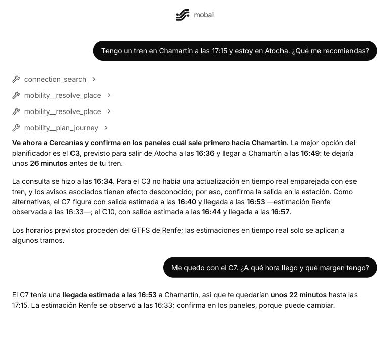
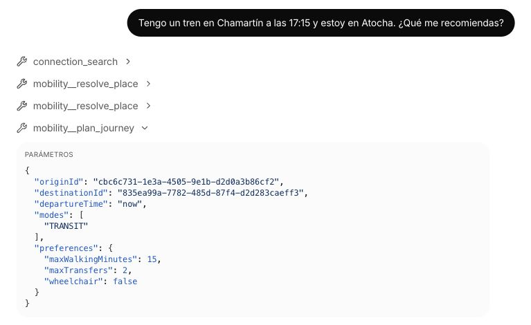
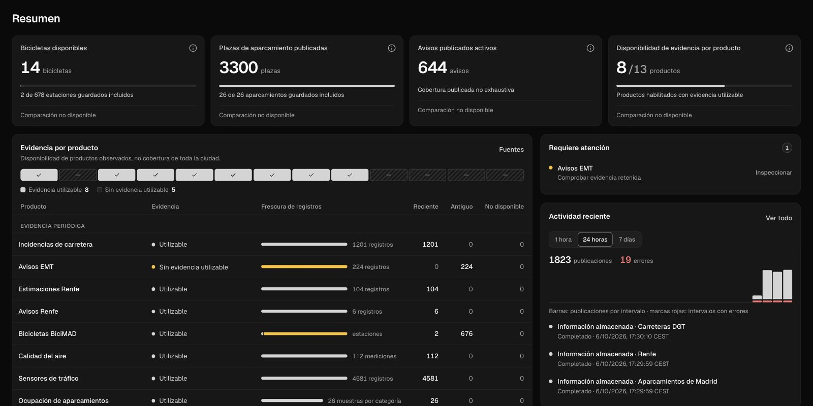
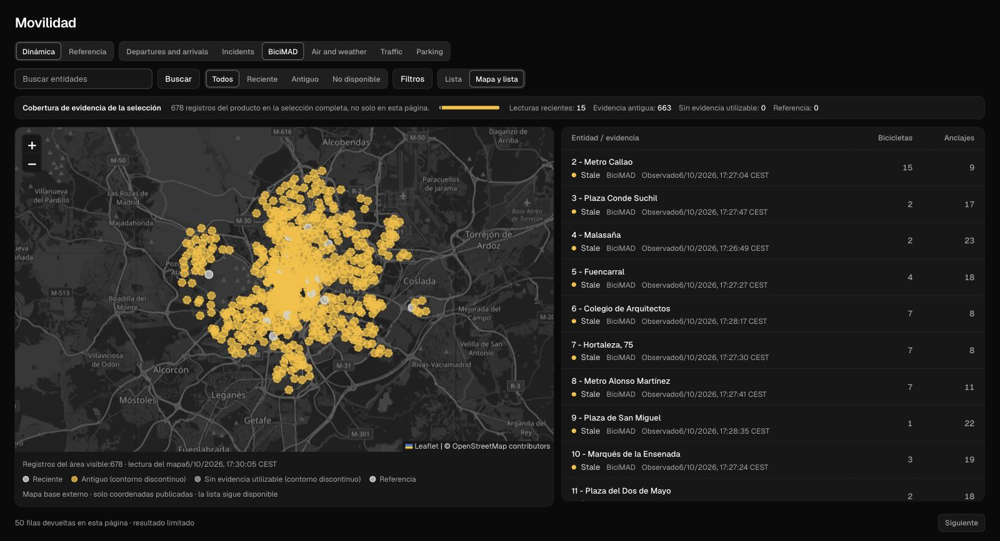

# mobai en pantalla

[Índice](index.md) · [Ver vídeo](https://github.com/user-attachments/assets/0e122168-1229-4229-b2bd-24607de5f756) · [Presentación](../README.md) · [Guía de uso](user-guide.md)

Del viaje que describes en el chat a los datos que puedes explorar en el panel. Las capturas corresponden al **7 de octubre de 2026**, con la interfaz unificada; cada vista conserva los valores, las fuentes y las horas que mostraba la aplicación. Pulsa cualquier imagen para abrirla a tamaño completo.

## Recorrido

- [Planificar y continuar la conversación](#planificar-y-continuar-la-conversación)
- [Ver las herramientas ejecutadas](#ver-las-herramientas-ejecutadas)
- [Leer el resumen de movilidad](#leer-el-resumen-de-movilidad)
- [Explorar las estaciones BiciMAD](#explorar-las-estaciones-bicimad)
- [Material y atribución](#material-y-atribución)

## Planificar y continuar la conversación

«Tengo un tren en Chamartín a las 17:15 y estoy en Atocha. ¿Qué me recomiendas?» El chat resuelve las dos estaciones, calcula alternativas y explica las horas de salida y llegada. Después, «Me quedo con el C7. ¿A qué hora llego y qué margen tengo?» continúa el mismo viaje, sin repetir origen y destino.

En este ejemplo, consultado el 6 de octubre, el seguimiento toma la llegada estimada a las 16:53 y calcula **22 minutos de margen** respecto al tren de las 17:15. La respuesta distingue el horario previsto de las estimaciones recibidas.

[Cómo plantear una consulta](user-guide.md) · [Flujo de conversación y routing](architecture.md)

## Ver las herramientas ejecutadas

Las llamadas aparecen dentro de la conversación y se pueden desplegar. `resolve_place` identifica las estaciones; `plan_journey` recibe los lugares, el modo de viaje y las preferencias, y devuelve el resultado del planificador.

La vista permite revisar qué se solicitó al servidor: en la captura, transporte público, un máximo de 15 minutos a pie y dos transbordos. Los parámetros y el resultado permanecen junto a la respuesta que los utiliza.

[Entradas y resultados de las herramientas MCP](reference/mcp.md)

## Leer el resumen de movilidad

El panel principal reúne bicicletas disponibles, plazas de aparcamiento, avisos y productos con evidencia utilizable. Debajo, la tabla desglosa la antigüedad de los registros por producto; la actividad reciente permite seguir las publicaciones recibidas.

Los indicadores de bicicletas y aparcamiento muestran también **cuántas estaciones o aparcamientos entran en el cálculo**. Así se puede interpretar una cifra junto a su cobertura, en lugar de confundirla con un total de toda la ciudad.

[Datos y funcionamiento del panel](architecture.md#panel-y-captura-de-observabilidad) · [Registro de fuentes](sources/README.md)

## Explorar las estaciones BiciMAD

La vista **Mapa y lista** sitúa las estaciones y muestra, al lado, las bicicletas y los anclajes disponibles en cada observación. Puedes buscar una estación, filtrar por antigüedad y abrir su ficha para consultar las métricas y el histórico retenido.

La captura muestra **678 estaciones en el área del mapa** y una página de 50 filas en la lista. El color de los marcadores indica la antigüedad de la evidencia; las cantidades de bicicletas y anclajes se leen en sus columnas. Mapa y tabla ofrecen dos formas de explorar la misma selección.

[Uso y actualización del panel](local-runtime.md#actualizar-el-panel) · [Fuentes y condiciones de los datos](sources/README.md)

## Material y atribución

- **Capturas:** archivos JPG en [assets/demo/](assets/demo/), obtenidos de la interfaz de mobai. Los encuadres conservan las respuestas, métricas y atribuciones visibles, sin reconstruir componentes ni modificar los datos.
- **Vídeo:** recorrido de 56 segundos, 1920 × 1080 y 60 fotogramas por segundo; textos en español y música de fondo. Solo se publica la pieza final; el proyecto de edición y las tomas no forman parte del repositorio.
- **Música del vídeo:** «Gold Standard — Premium Brand Vibe», pista aportada para esta demo. La licencia MIT del código no concede derechos sobre la pista.
- **Cartografía:** © [OpenStreetMap contributors](https://www.openstreetmap.org/copyright). Las condiciones de reutilización de los datos se recogen en el [registro de fuentes](sources/README.md).

[Volver a la presentación](../README.md) · [Referencias para publicar el vídeo](resources/index.md#vídeo-y-capturas--06102026)
