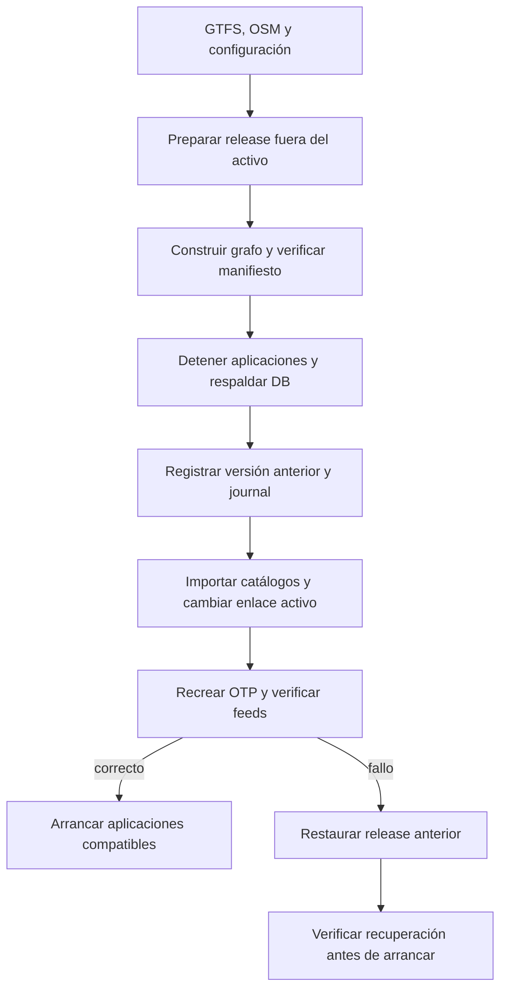

# Releases locales de routing

[Índice](index.md) · [Instalación](installation.md#datos-y-routing) · [Operación](local-runtime.md) · [Evidencia](acceptance/2026-09-25-routing-releases.md)

Una **release** reúne GTFS, catálogos normalizados, calles OSM, configuración/imagen OTP y grafo construido. Permite actualizarlos juntos y recuperar una versión anterior coherente. Los hashes SHA-256 del manifiesto identifican los archivos.

## En esta página

- [Flujo de actualización](#flujo-de-actualización)
- [Preparar y construir](#preparar-y-construir)
- [Activar en mantenimiento](#activar-en-mantenimiento)
- [Volver atrás o recuperar una activación](#volver-atrás-o-recuperar-una-activación)
- [Tiempo real sobre rutas previstas](#tiempo-real-sobre-rutas-previstas)

## Flujo de actualización



1. [Preparación](../scripts/prepare-routing-release.py) trabaja bajo `data/routing-releases/<id>`, no sobre el activo.
2. [Construcción](../scripts/build-routing-release.mjs) guarda grafo e informes en esa release.
3. [Activación](../scripts/activate-routing-release.mjs) exige mantenimiento y guarda un journal: registro de una transición no terminada.
4. Catálogos y grafo cambian como una operación de mantenimiento con recuperación compensatoria, **no como una transacción de cero interrupciones**.
5. Core rechaza routing mientras exista el journal o no coincidan versiones. Un fallo no se oculta devolviendo una ruta de otra versión.

## Preparar y construir

```sh
# Reutiliza archivos preparados; rechaza archivos fuente contradictorios.
python3 scripts/prepare-routing-release.py
# Alternativa: descarga expresamente nuevas fuentes oficiales.
python3 scripts/prepare-routing-release.py --refresh
node scripts/build-routing-release.mjs <release-id>
```

Elige **una** preparación. Sustituye `<release-id>` por el ID resultante. No hay scheduler de actualización de grafos. Un fallo en esta etapa no cambia la versión activa.

Los calendarios por feed deciden la elegibilidad inicial; OTP aplica después días, excepciones y frecuencias. Un feed caducado puede conservar catálogo sin entrar en el grafo. La [release documentada](acceptance/2026-09-25-routing-releases.md) incluyó Renfe, EMT, Metro Ligero e interurbanos. Los horarios/routing actuales de Metro y nuevas correspondencias quedan fuera del [alcance acordado](roadmap.md).

La versión EMT preparada en aquella entrega tenía cobertura 24/07/2026–31/12/2026 y 72.510 filas de frecuencia. Son datos de esa versión, no una garantía del próximo feed. Una frecuencia no exacta produce una estimación de planificación, no una salida puntual publicada.

En una instalación vacía crea antes la [base inicial Renfe](installation.md#datos-y-routing). El activador necesita grafo/export/DB coherentes para capturar el destino de rollback inicial.

## Activar en mantenimiento

1. Detén el supervisor conocido `start:local` con Ctrl-C/SIGTERM. Comprueba que Core, Web, agente y worker han terminado. No mates procesos ajenos por puerto.
2. Conserva Postgres activo y crea el [respaldo privado](local-runtime.md#respaldo-y-recuperación).
3. Ejecuta:

```sh
pnpm db:migrate
node --env-file=.env.local scripts/activate-routing-release.mjs activate <release-id> --maintenance
pnpm check
pnpm build:agent
pnpm start:local
```

El script comprueba hashes, adquiere un bloqueo local exclusivo y registra la versión previa antes de modificar la instalación. Importa catálogos, cambia `data/otp` por un enlace atómico y recrea OTP. En la primera activación conserva el directorio original. Verifica los feeds cargados antes de terminar. Las aplicaciones permanecen paradas durante la transición.

Los IDs estables se conservan. Las paradas API EMT se relacionan con GTFS solo por ID publicado idéntico, coordenadas a menos de 100 m y coincidencia única. Sus UUIDs siguen separados. Las correspondencias de un itinerario incluyen los identificadores y la caminata calculada, no una garantía de accesibilidad ni conexión.

## Volver atrás o recuperar una activación

Con aplicaciones detenidas:

```sh
node --env-file=.env.local scripts/activate-routing-release.mjs rollback --maintenance
# Si hubo una transición interrumpida:
node --env-file=.env.local scripts/activate-routing-release.mjs recover --maintenance
```

`rollback` vuelve a la release anterior registrada. `recover` usa el journal de la transición interrumpida. No ejecutes ambos de forma rutinaria. No restaura tablas de autenticación ni contenido conversacional.

Si la activación falla intenta compensar automáticamente. Si también falla la compensación, deja el journal y las aplicaciones paradas. Corrige el problema de disco, Docker o DB y ejecuta `recover`. El comando no roba el bloqueo de un proceso vivo. **No borres el journal para eludir la protección.**

Los renombrados atómicos no protegen contra toda corrupción de disco: conserva backup y directorios de release. No ejecutes `otp:prepare`/`otp:build` legacy sobre el enlace activo; rechazan sobrescribirlo.

## Tiempo real sobre rutas previstas

OTP **no tiene updaters RT** en esta instalación. Core reutiliza snapshots del worker y preserva horarios originales.

- Renfe se aplica solo con versión estática, identidad del viaje y fecha de servicio compatibles, además de frescura.
- Si falta fecha explícita, la política existente usa día de observación Madrid y una ventana de dos horas respecto al horario. Se etiqueta `observation_day_nearby_schedule`; no se presenta como fecha publicada por Renfe.
- Estimaciones de extremos requieren identidad de parada inequívoca. Un retraso global solo se propaga cuando las actualizaciones son compatibles y no hay ambigüedad/`NO_DATA`; prevalecen estimaciones absolutas de los extremos.
- Paradas repetidas sin secuencia suficiente conservan horarios previstos. Cancelaciones y extremos omitidos retiran candidatos; se comprueban caminatas y conexiones perdidas antes de ordenar.
- Cerca de «ahora», un retraso positivo fresco permite una búsqueda OTP adicional, hasta 30 minutos y diez candidatos, para encontrar trenes todavía abordables. No pretende cubrir retrasos mayores exhaustivamente.
- Avisos Renfe activos y con selectores retenidos anotan tramos; `NO_SERVICE` puede excluir alternativas afectadas. Avisos sin esos selectores no cancelan rutas por suposición.
- Avisos EMT frescos se adjuntan por etiqueta exacta y vigencia. Conservan ceros iniciales; no inventan geometrías alternativas ni cancelan un viaje sin evidencia.

Estimaciones EMT por parada no se asignan a un viaje GTFS por compartir línea. Evidencia parcial sigue siendo parcial, no un viaje completo en vivo. Las ampliaciones RT/accesibilidad y bici/coche excluidas no son pendientes de esta entrega.

**Implementación:** [routing](../apps/mobility-core/src/routing.ts), [evidencia](../apps/mobility-core/src/routing-evidence.ts), [reglas RT](../packages/domain/src/routing-realtime.ts). **Fuentes:** [OTP 2.10.0](https://docs.opentripplanner.org/en/v2.10.0/), [GTFS-RT](https://gtfs.org/documentation/realtime/reference/#message-tripupdate), [registro de fuentes](sources/README.md). **Pruebas:** [E1](acceptance/2026-09-25-routing.md) y [release/rollback](acceptance/2026-09-25-routing-releases.md).
